# Exercise 1 -- Plan Story Navigation and Enrichment

**Objective:** You should develop an understanding of basic story
navigation, and how to modify a story to include new visualiziations,
change existing widget settings, and leverage custom widgets and script
to improve our planning template.

**Estimated Time:** 25 mins

**Exercise Description:**  CycleBros is a Germany headquartered
recreational bike manufacturer and distributor. You are an FP&A analyst
for CycleBros, and you are looking to make changes to existing dashboard
to support the upcoming planning cycle, including some customization for
specific changes occurring in the US region and end-user requested
enhancements.

**Key Features:**

-   Basic navigation of the dashboard

-   Inclusion of new widgets and minor changes to existing widget
    settings

-   Introduction of a custom widget and script to support direct
    end-user upload of planning data

⚠️**Disclaimer** When completing exercises, it is expected that data
values or screenshots should match what you see on your screen. If you
see inconsistencies as you work through the exercise, please refer to
the appropriate section in **Getting Started** Readme. For any
inconsistencies which are not addressed therein, please check with your
instructor.

🚩As a FP&A Analyst for CycleBros, we are interested in extending the
existing dashboard that incorporates Business Intelligence and Planning.
Start by reviewing the initial dashboard. You will notice that we have 2
tabs. The tab first is tracking financial performance for the current
year (currently filtered to All Regions and the current close period --
Oct 2023). In the second tab, we have a sales plan entry template which
is meant to capture sales quantity forecasts by period for each of
products. Note that we have included a couple of input controls (i.e.,
plan version and user) which are already selected and are not meant to
be modified during the exercise (this is to simplify data capture and
data segregation for TechEd). Additionally, for the purposes simplicity
we have narrowed the exercises to primarily focus on the US region. We
will make a couple of minor changes to dashboard filters, while also
making some additional enhancements to improve end-user plan entry
flexibility.

Let's start by editing the dashboard!

1.  First ensure you are on the Financial Overview tab. Then
    click **Edit** to change the dashboard to authoring mode.

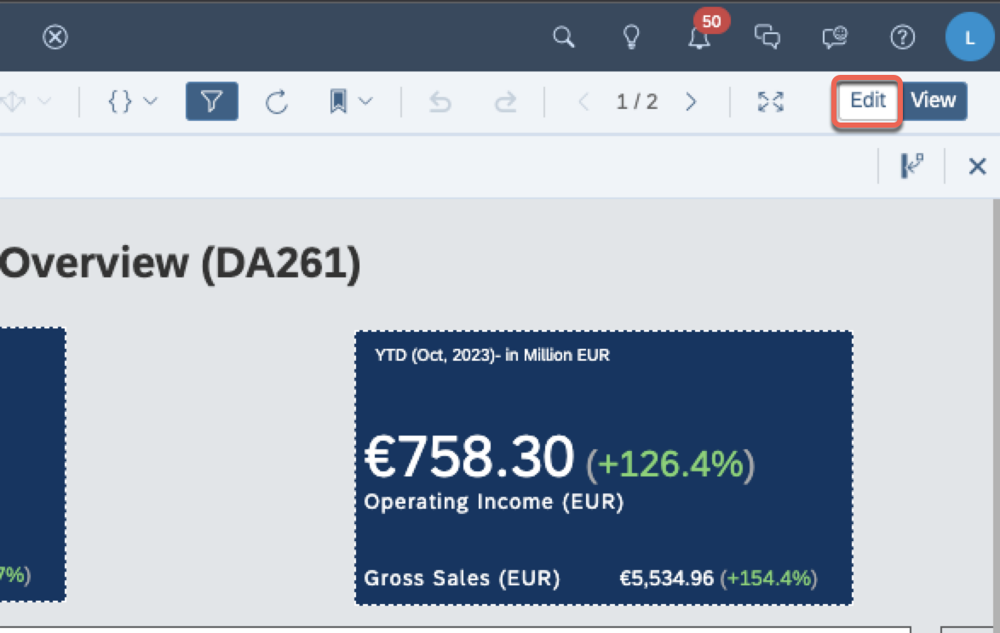{width="3.709212598425197in"
height="2.3507534995625545in"}

🚩 The first thing we want to do is make some end-user requested changes
to the Financial Overview page. This include updating the dashboard
title to dynamic reflect our region filter selection, changing the
default filter for region to focus on the US, and modifying the default
drill level for our P&L in the table widget.

2.  In the dashboard title text box, highlight the **DA261** and click
    the delete key

{width="5.303055555555556in"
height="2.683821084864392in"}

3.  With your cursor between the brackets () right-click. Select **Add**
    \> **Dynamic Text**

{width="5.372487970253719in"
height="2.8647528433945757in"}

4.  From the Insert Dynamic Text popup, select **Story Filters** and
    check the box for **SAP_XPA_REGION** and click the **Create** button

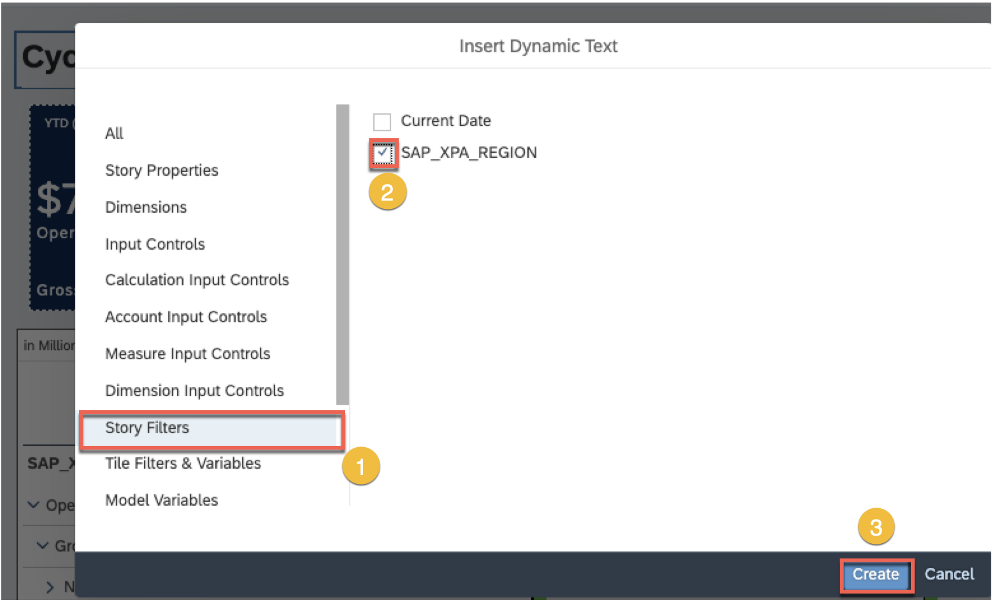{width="4.804355861767279in"
height="2.907250656167979in"}

5.  Now let's change the default filter selection for the region by
    clicking on the **SAP_XPA_REGION** filter at the top of the
    dashboard and deselecting the **All** filter 

{width="4.32251312335958in"
height="2.943093832020997in"}

6.  Select **United States** and click **Apply Selections**

{width="4.337691382327209in"
height="3.003480971128609in"}

6.  Finally, let's change the default drill depth in our table by first
    right-clicking on the **SAP_XPA_ACCOUNT** dimension header within
    the table. Select **Drill** \> **Level 4**

{width="5.006540901137358in"
height="2.9910870516185475in"}

7.  Click **File/Save** to save your dashboard updates

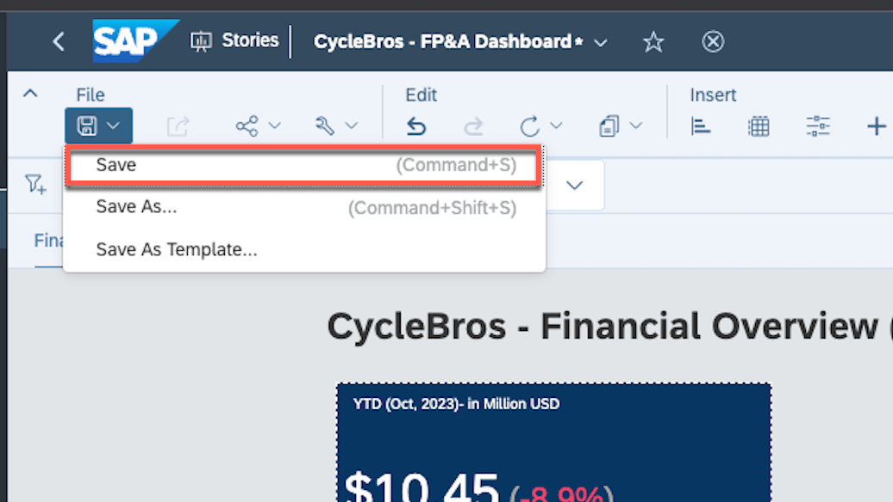{width="4.919792213473316in"
height="2.7731649168853894in"}

⚠️**Quality Check!** Does your dashboard look like this?

{width="5.855562117235346in"
height="4.243406605424322in"}

🚩 Now that we have updated the Financial Overview, we are next going to
make some preliminary changes to the Sales Plan Entry tab to prepare for
the upcoming planning cycle. We are going to add two new widgets. The
first will simplify review of total units planned, while the second will
introduce a custom widget to provide a mechanism for end-users to
directly upload their sales plan numbers from csv or xls.

8.  Navigate to the **Sales Plan Entry** tab, and review the template

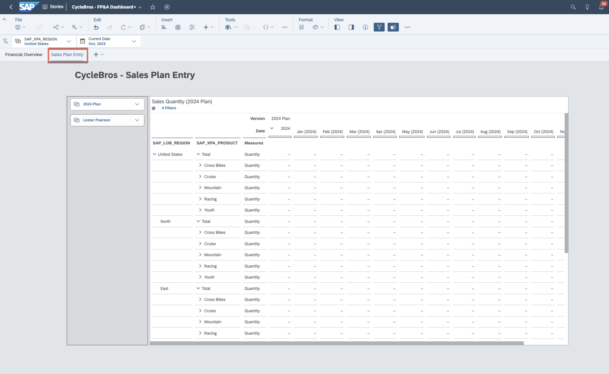{width="6.3229494750656166in"
height="3.8836154855643046in"}

🚩 We want to add a a numeric point chart to track full year total
quantity planned. This number will ultimately be visible in the table as
well, but we want to make it more prominent the end-user. Rather than
inserting a net-new chart, we are going to duplicate an existing object
and repoint it.

9.  Navigate back to the **Financial Overview** tab, and select the Unit
    Sales numeric point chart

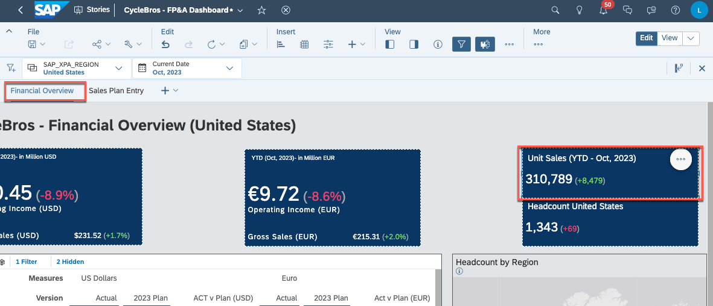{width="5.725449475065616in"
height="2.465123578302712in"}

10. From the widget menu select **Copy \> Copy To \> Sales Plan Entry**

{width="4.35267060367454in"
height="2.425462598425197in"}

11. Navigate to the **Sales Plan Entry** tab

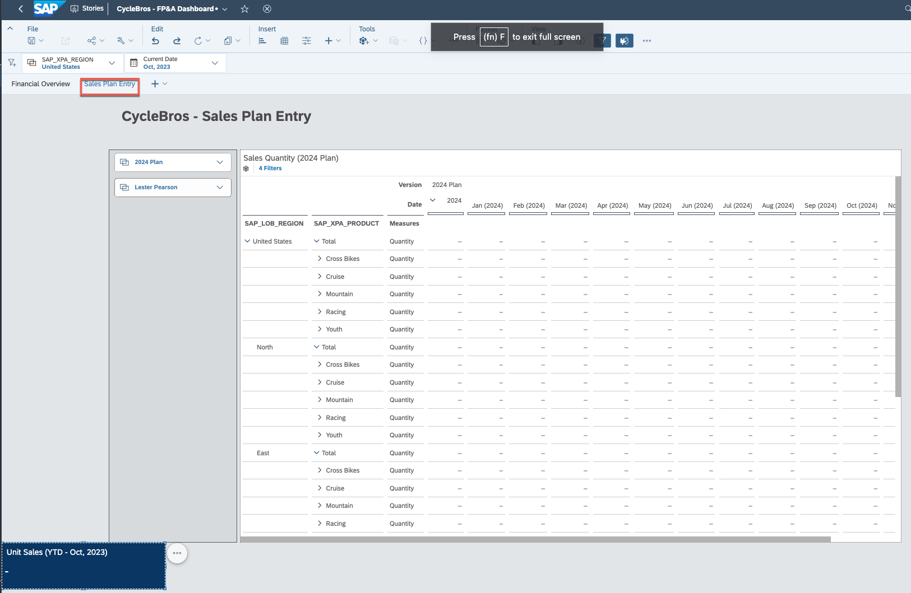{width="5.4080238407699035in"
height="3.206809930008749in"}

12. Move (click and drag) and resize the widget (select corner or edge
    and click-drag) so the right side aligns with the right side of the
    table widget so it appears similar to the screenshot below

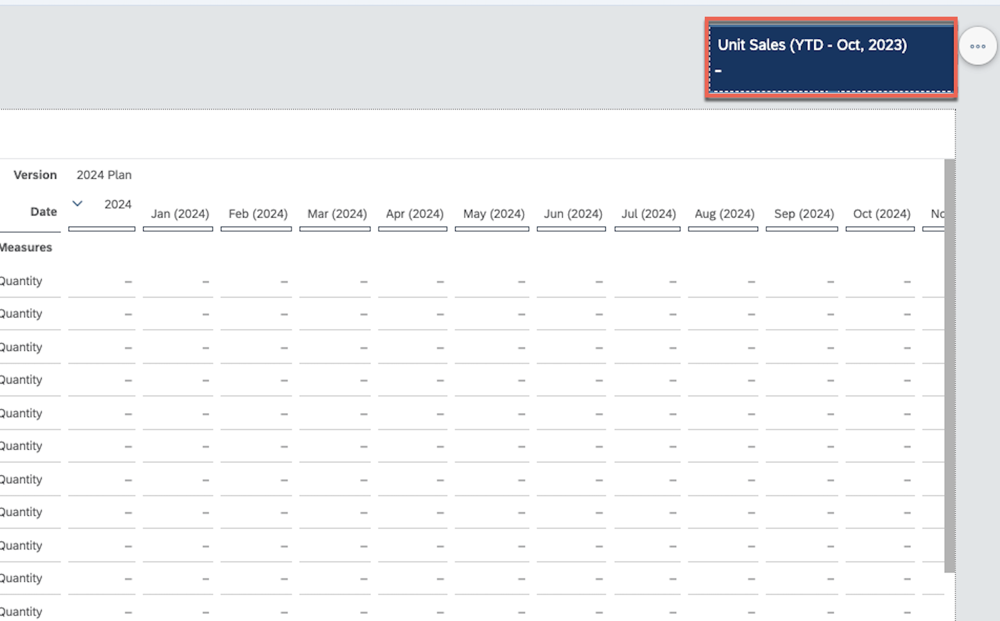{width="4.82380249343832in"
height="2.996839457567804in"}

13. Highlight the **YTD -- Oct, 2023** in the widget title and click the
    delete key (note that the Oct, 2023 is dynamic text referencing the
    Current Date story filter)

{width="4.220390419947506in"
height="2.3832797462817146in"}

14. With your cursor between the brackets () right-click. Select **Add
    \> Dynamic Text**

{width="4.397191601049869in"
height="2.424397419072616in"}

15. Select Input Controls, and check **Version.** The click the
    **Create** button.

{width="4.400566491688539in"
height="2.730544619422572in"}

16. Click on the chart (to ensure it is selected) and open the **Right
    Side Panel.** If not already active, toggle the **Builder** panel

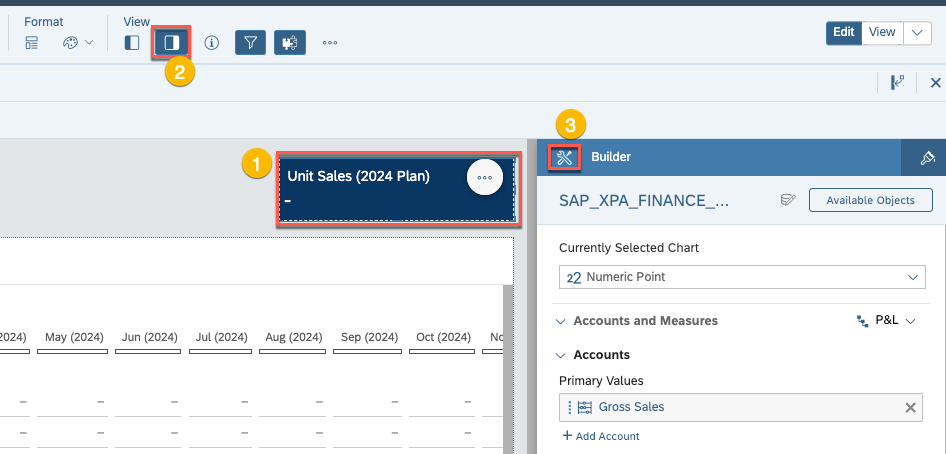{width="5.81383530183727in"
height="2.7901432633420824in"}

17. Click on the **Select Model** button in the Builder panel

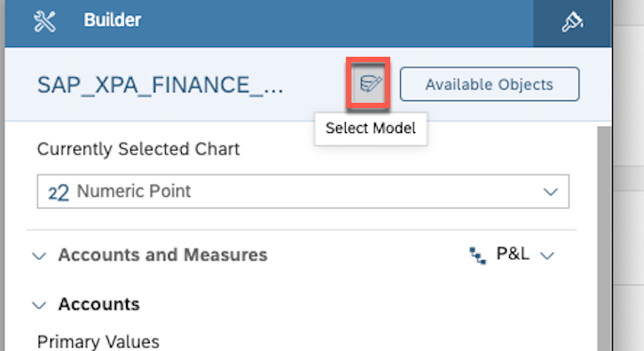{width="4.448290682414698in"
height="2.5518121172353454in"}

18. Select **OK** on the resulting warning message

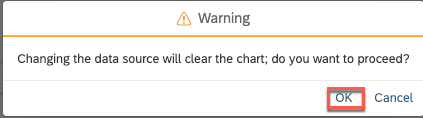{width="4.02061789151356in"
height="1.124248687664042in"}

19. Click on the Select Model dropdown and choose the
    **SAP_XPA_SALESPLAN_TE2023**

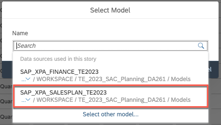{width="4.0714916885389325in"
height="2.303607830271216in"}

20. Click the **OK** button

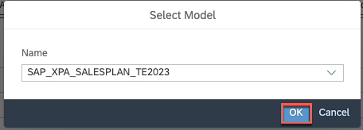{width="3.1666666666666665in"
height="1.1388888888888888in"}

21. Configure the builder panel as displayed in the image below

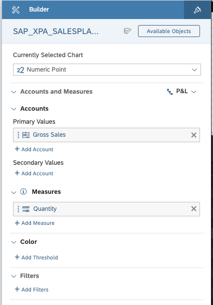{width="2.365123578302712in"
height="3.3755752405949258in"}

22. Navigate to the styling panel. Change the ID of the chart to
    **SP_US_FY_CHT**. Hit the Enter key to commit the ID change

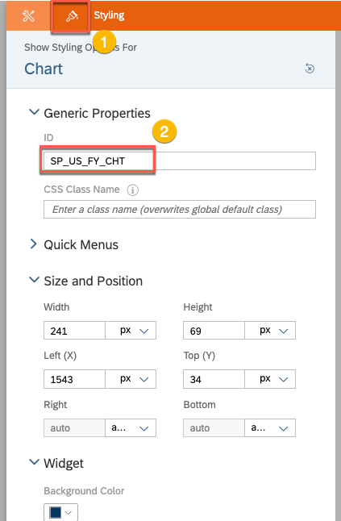{width="2.5301060804899387in"
height="3.873097112860892in"}

23. Click the widget menu for the numeric point chart. Then choose
    **More Options \> Show/Hide \> Primary Value Labels** to toggle off
    the Gross Sales label

{width="3.961298118985127in"
height="2.0403226159230097in"}

24. Click the **File \> Save** menu to save your dashboard

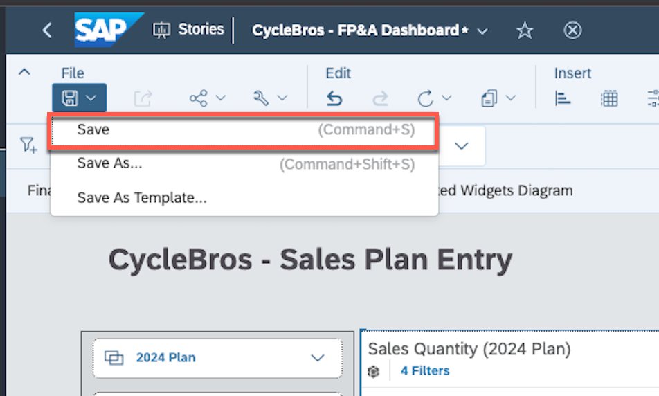{width="4.0127449693788275in"
height="2.411077209098863in"}

⚠️**Quality Check!** Does your Sales Plan Entry tab look as follows?
Note: the Plan_Contributor input control will reflect your user ID

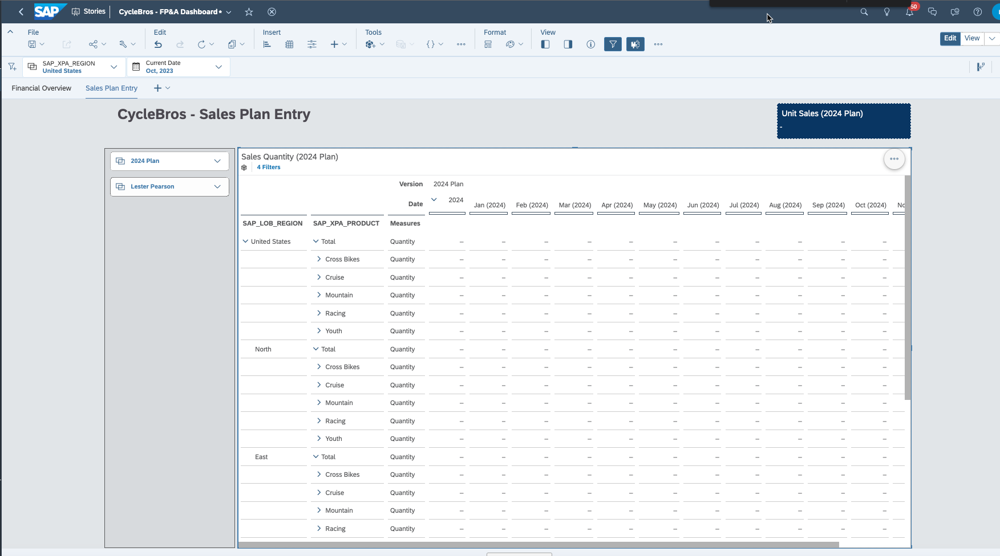{width="6.5in"
height="3.620833333333333in"}

🚩 Now that we have made basic updates to the input template, we are
going to introduce some scripting components to leverage a custom widget
allowing end-users to directly upload a csv or xls from their local
computer.

25. Open the **Left Side Panel**

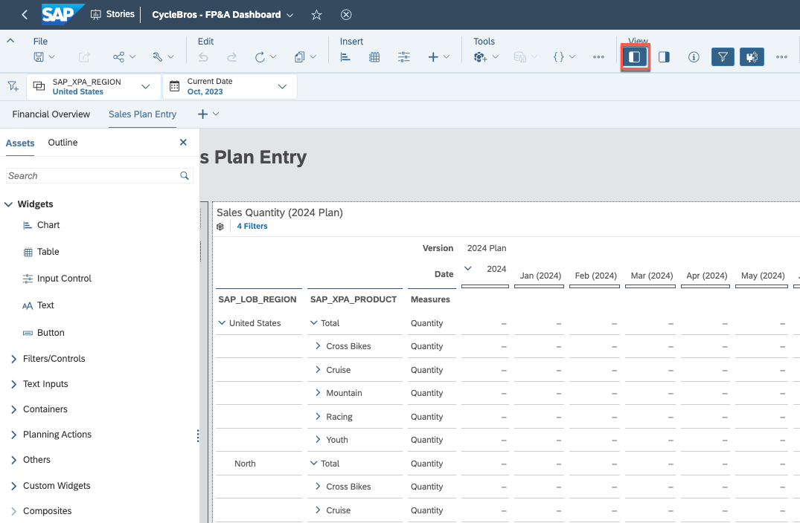{width="5.329251968503937in"
height="3.4930522747156605in"}

26. Under the **Assets** menu, expand **Custom Widgets**

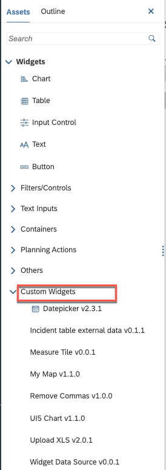{width="1.3220844269466316in"
height="1.5446741032370954in"}

27. Select the **Upload XLS v2.0.1** and drag it into an open space on
    the canvass near the top of the tab (note that the widget label will
    disappear once you have finished positioning the widget)

{width="3.784948600174978in"
height="3.0609962817147855in"}

28. From the insert menu let's add a new **Button** (we'll use this to
    call our custom widget)

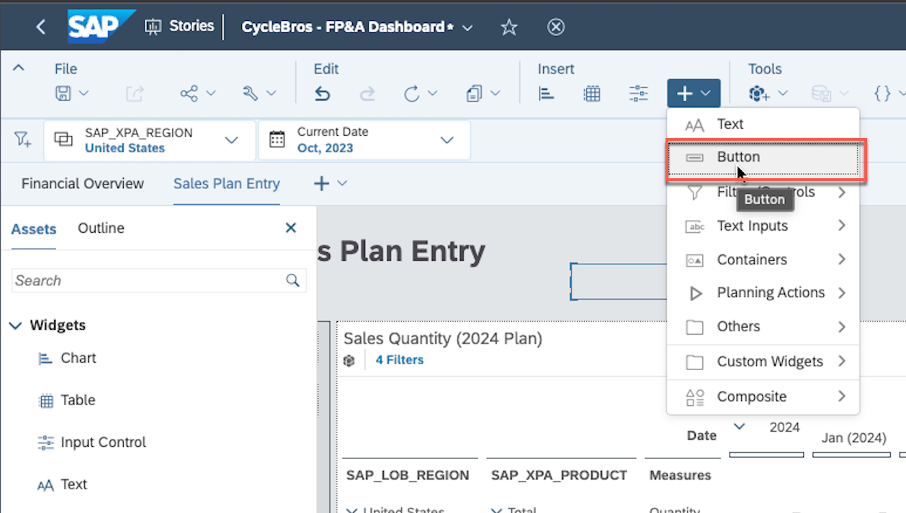{width="4.4083869203849515in"
height="2.5018536745406825in"}

29. Open up the styling menu of the button and change the settings to
    the following

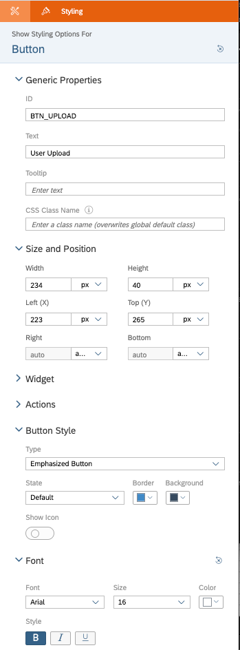{width="2.4166666666666665in"
height="6.555555555555555in"}

🚩 Finally, we need to add JavaScript to trigger events in both the
custom widget and the button to call the custom widget. The custom
widget includes multiple custom events (part of the widget code itself),
but in the interest of time we will only populate two of these with
script. Upon click, the button we inserted in the previous step will
define a series of mappings (based on a predefined structure of the
upload file to the model we are uploading the data into), and then call
the custom widget. The custom widget has events to 1) display status
information during the file upload process, and 2) process the data into
the model once the file upload is complete including reporting any
errors and a reject file if some records are not loaded.

30. If it is not already visible, then open the Left Side Panel. Select
    the **UploadXLS_1** which should appear within the
    **SalesPlanEntry** page in the Outline menu

{width="4.144607392825897in"
height="3.1539009186351707in"}

31. Click on the **Edit Scripts** button and select the **onFileUpload**
    event

{width="1.8352373140857392in"
height="2.53330271216098in"}

32. Paste the following Javascript into the function dialog:

> *var sheets = UploadXLS_1.getSheetNames();*
>
> *var records = UploadXLS_1.getTotalRows(sheets\[0\]);*
>
> *var chunkSize = UploadXLS_1.getChunkSize();*
>
> *if(records \<= chunkSize){*
>
> *Application.showBusyIndicator(\'Uploading \'+records.toString() + \'
> rows from the Excel file\');*
>
> *}else{*
>
> *Application.showBusyIndicator(\'Uploading first
> \'+chunkSize.toString() + \' rows from the total \'+records.toString()
> +\' in the Excel file\');*
>
> *}*

{width="6.5in"
height="2.671527777777778in"}

33. Click on the **Edit Scripts** button and select the **onDataUpload**
    event

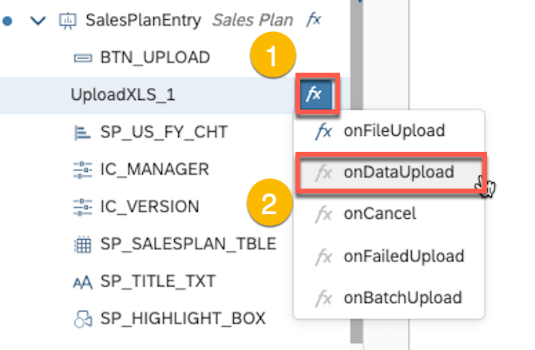{width="2.531923665791776in"
height="1.655197944006999in"}

34. Paste the following Javascript into the function dialog:

*SP_SALESPLAN_TBLE.getDataSource().refreshData();*

*Application.hideBusyIndicator();*

*var status = this.getUploadResult().jobStatus;*

*if (status ===
sdk_com_sap_sample_uploadxls\_\_2_JobStatus.COMPLETED_WITH_FAILURES){*

*console.log(this.getUploadResult().failedRows);*

*this.downloadFailedRecords();*

*}*

*SP_US_FY_CHT.getDataSource().refreshData();*

*console.log(this.getUploadResult().jobStatus);*

{width="6.5in"
height="2.870833333333333in"}

35. Click on the **Edit Scripts** button and select the
    **onFailedUpload** event

{width="2.439268372703412in"
height="1.7625688976377953in"}

36. Paste the following Javascript into the function dialog:

*Application.showMessage(ApplicationMessageType.Error,\'There was an
error uploading the Excel data\');*

*Application.hideBusyIndicator();*

*console.log(this.getUploadResult());*

37. Select the **BTN_UPLOAD** which should also appear within the
    SalesPlanEntry page in the Outline menu

{width="1.5845275590551182in"
height="2.5928619860017497in"}

38. Click on the **Edit Scripts** button and select the **onClick**
    event

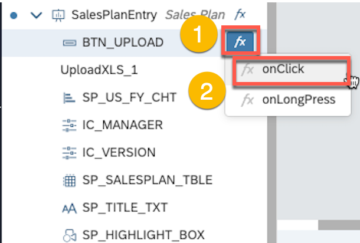{width="2.8422911198600174in"
height="1.919711286089239in"}

39. Paste the following JavaScript in the function dialog:

*var modelId = SP_SALESPLAN_TBLE.getDataSource().getInfo().modelId;*

*UploadXLS_1.setModelId(modelId);*

*var mappings = {*

*\"SAP_XPA_ACCOUNT\":\"Account\",*

*\"Version\":\"Version\",*

*\"SAP_XPA_PRODUCT\":\"Product\",*

*\"SAP_XPA_BUSUNIT\":\"Org\",*

*\"SAP_LOB_REGION\":\"Sales Region\"*

*};*

*var defaultValues = {*

*\"SAP_XPA_MGR\":IC_MANAGER.getInputControlDataSource().getActiveSelectedMembers()\[0\].displayId*

*};*

*UploadXLS_1.uploadData(mappings,defaultValues,true,\"\",false);*

*Application.showBusyIndicator(\'Uploading File\...\');*

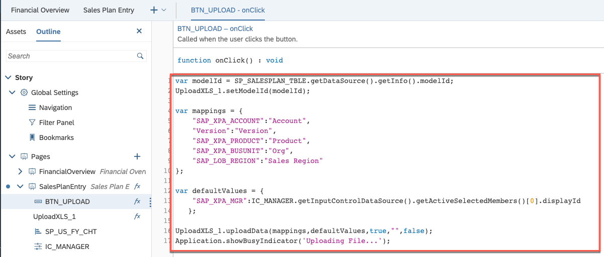{width="6.1447769028871395in"
height="2.6279418197725284in"}

40. Click the **File \> Save** menu to save your dashboard

{width="3.5221970691163604in"
height="1.7817202537182852in"}

🚩 In the final step of exercise 1, we will test our template changes,
including our upload widget. Recall where you saved the
SalesPlan_Quantity.xls file in the getting started section as we will
use that file for our testing. Also note that we have not fully coded
the upload button as we would in a production scenario (e.g., process
cancellation, error trapping) due to time considerations, so proceed
through these steps slowly. If you experience any issues, consider
reloading your story (**View** \> **Reload this Page** in Chrome)

41. Click the View mode button to change from edit mode to view mode

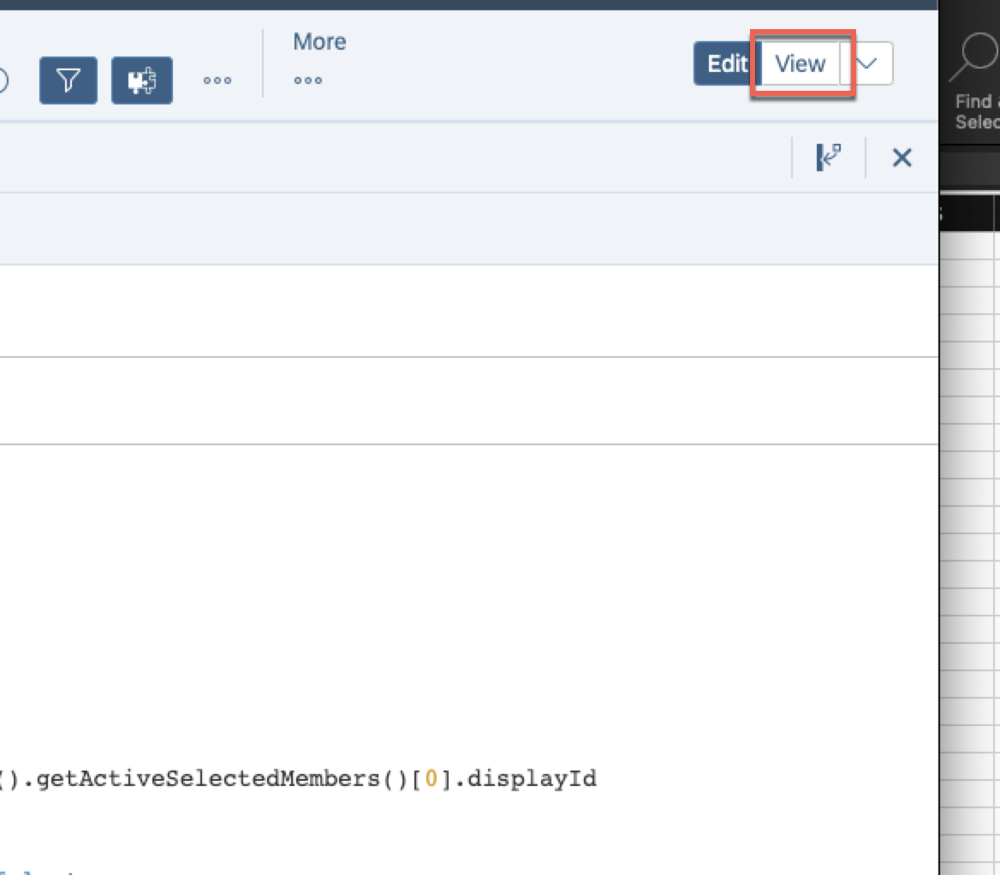{width="3.408377077865267in"
height="1.8101345144356955in"}

42. Navigate to the **Sales Plan Entry** tab

{width="5.13905949256343in"
height="2.6881233595800524in"}

43. Ensure the page has fully loaded, and then click on the **User
    Upload** button 

{width="4.315733814523185in"
height="2.733759842519685in"}

44. From the file system dialog, locate the **SalesPlan_Quantity.xls**
    file and click **OK**

🚩 At this point you should see a popup dialog indicating that 1008 rows
are being uploaded from the Excel file. This upload may take a few
moments after which you should see the dashboard refresh with the upload
quantities.

⚠️**Quality Check!** Does your refreshed dashboard (including upload
results) look like this? Note: the Plan_Contributor input control will
reflect your user ID

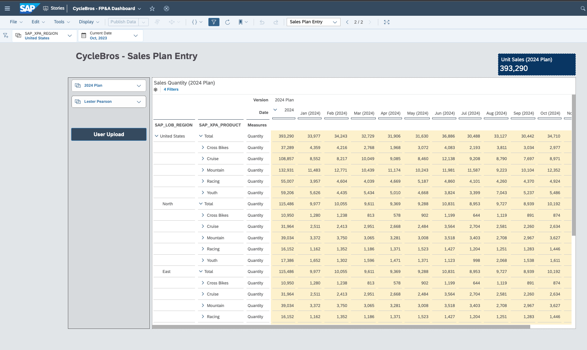{width="6.5in"
height="3.8826388888888888in"}

## Summary

**Congratulations, you have completed Exercise 1!**

**You are now able to:**

-   Make simple changes to an existing dashboard

-   Introduce additional charts and widgets into your dashboard

-   Leverage JavaScript script to further tailor your planning template
