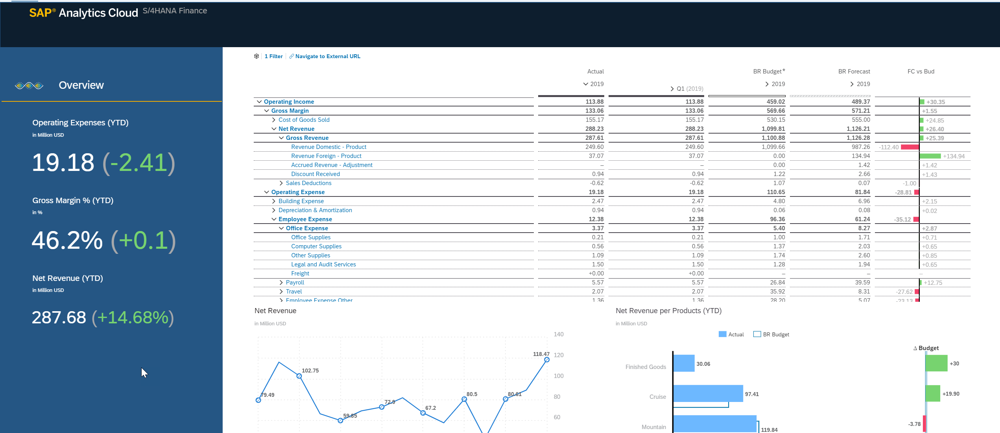
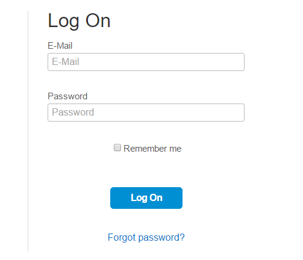
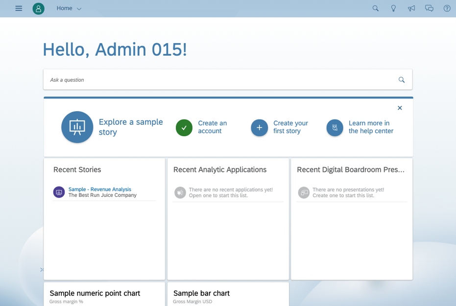
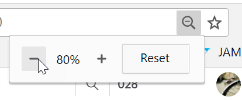

+-----------------------------------------------------------------------+
|                                                                       |
+=======================================================================+
| SAP Analytics Cloud                                                   |
|                                                                       |
| Planning for S/4HANA                                                  |
+-----------------------------------------------------------------------+
|                                                                       |
+-----------------------------------------------------------------------+

{width="6.26875in"
height="2.717361111111111in"}

You\'ve heard of SAP Analytics Cloud, but do you know what it\'s all
about? In this workshop, see how the tool will help you to visualize,
analyse, and share data for all your business intelligence and planning
needs. Learn about its different functions and see its capabilities in
action by following along with a real-life demo scenario. Are you ready
to move your Analytics to the cloud?

+-----------------------------------------------------------------------+
| WORKSHOP                                                              |
|                                                                       |
| Version 2022                                                          |
+-----------------------------------------------------------------------+
|                                                                       |
+-----------------------------------------------------------------------+

Document Version: May 19, 2022

[1 Introduction [3](#introduction)](#introduction)

[1.1 Before you begin [3](#before-you-begin)](#before-you-begin)

[2 Demo [3](#demo)](#demo)

[2.1 Show S/4HANA content
[3](#show-s4hana-content)](#show-s4hana-content)

[3 Logon to SAC [4](#logon-to-sac)](#logon-to-sac)

[3.1 Login with credentials
[4](#login-with-credentials)](#login-with-credentials)

[4 Create the Model and Dimensions
[5](#create-the-model-and-dimensions)](#create-the-model-and-dimensions)

[4.1 Create a blank Model
[5](#create-a-blank-model)](#create-a-blank-model)

[4.2 Create the Profit Center Dimension
[9](#create-the-profit-center-dimension)](#create-the-profit-center-dimension)

[4.3 Import the existing Master Public Dimensions
[10](#import-the-existing-master-public-dimensions)](#import-the-existing-master-public-dimensions)

[4.4 Create the Measures [11](#_Toc103669592)](#_Toc103669592)

[5 Import the Master Data -- Profit Center Dimension
[13](#import-the-master-data-profit-center-dimension)](#import-the-master-data-profit-center-dimension)

[5.1 Import the base members to the Profit_Center_S4\_### dimension
[14](#import-the-base-members-to-the-profit_center_s4_-dimension)](#import-the-base-members-to-the-profit_center_s4_-dimension)

[5.2 Import the Parent Nodes to the Profit_Center_S4\_### dimension
[17](#import-the-parent-nodes-to-the-profit_center_s4_-dimension)](#import-the-parent-nodes-to-the-profit_center_s4_-dimension)

[5.3 Assign the Hierarchy values to the Profit_Center_S4\_### dimension
[19](#assign-the-hierarchy-values-to-the-profit_center_s4_-dimension)](#assign-the-hierarchy-values-to-the-profit_center_s4_-dimension)

[6 Import P&L Data -- Actual
[22](#import-pl-data-actual)](#import-pl-data-actual)

[6.1 Import Actual Data From S/4HANA
[22](#import-actual-data-from-s4hana)](#import-actual-data-from-s4hana)

[6.2 Prepare Data for Import
[25](#prepare-data-for-import)](#prepare-data-for-import)

[6.3 Map to Target [26](#map-to-target)](#map-to-target)

[6.4 Finish Mapping and Load Data
[27](#finish-mapping-and-load-data)](#finish-mapping-and-load-data)

[7 Import P&L Data -- Budget
[28](#import-pl-data-budget)](#import-pl-data-budget)

[7.1 Import Budget Data From S/4HANA
[28](#import-budget-data-from-s4hana)](#import-budget-data-from-s4hana)

[7.2 Prepare Budget Data for Import
[30](#prepare-budget-data-for-import)](#prepare-budget-data-for-import)

[7.3 Map to Target [31](#map-to-target-1)](#map-to-target-1)

[7.4 Finish Mapping and Load Data
[32](#finish-mapping-and-load-data-1)](#finish-mapping-and-load-data-1)

[8 Build the Story [33](#build-the-story)](#build-the-story)

[8.1 Create a Forecast View
[33](#create-a-forecast-view)](#create-a-forecast-view)

[8.2 Build a Forecast Version
[35](#build-a-forecast-version)](#build-a-forecast-version)

[8.3 Populate the Forecast version
[37](#populate-the-forecast-version)](#populate-the-forecast-version)

[8.4 Build Data Action to seed BUDGET 2023
[41](#build-data-action-to-seed-budget-2023)](#build-data-action-to-seed-budget-2023)

[8.5 Build Budget page in Story
[44](#build-budget-page-in-story)](#build-budget-page-in-story)

[9 EXPORT DATA BACK TO S/4HANA
[48](#export-data-back-to-s4hana)](#export-data-back-to-s4hana)

[9.1 Create the Export Job
[48](#create-the-export-job)](#create-the-export-job)

[10 APPENDIX -- OPTIONAL ACTIVITIES
[52](#_Toc103669615)](#_Toc103669615)

[10.1 Create the Conversion Measure
[52](#create-the-conversion-measure)](#create-the-conversion-measure)

[10.2 Use the Conversion Measure in a Story
[53](#use-the-conversion-measure-in-a-story)](#use-the-conversion-measure-in-a-story)

[10.3 Copy Budget from Forecast
[59](#copy-budget-from-forecast)](#copy-budget-from-forecast)

[10.4 Add Percentage Increase to Data Action
[62](#add-percentage-increase-to-data-action)](#add-percentage-increase-to-data-action)

[10.5 Add Hyperlink to S4
[74](#add-hyperlink-to-s4)](#add-hyperlink-to-s4)

# Introduction

## Before you begin

To run this hands on workshop you will need:

-   Laptop with Google Chrome

-   [SAC Workshop Guide]{.mark}

-   [SAC Workshop Files.zip file containing folders ***DataFiles***,
    ***ModelBuild*** and ***ProfileImages***]{.mark}

-   [Assigned **User Email Id**]{.mark}

-   [Access to Workshop tenant provided by your trainer]{.mark}

-   [Your **\###** code (which is part of your email ID). You should
    replace \### in any instructions with your number.]{.mark}

```{=html}
<!-- -->
```
-   Note that paragraphs with the mouse icon indicate actions for you to
    do

```{=html}
<!-- -->
```
-   Paragraphs with the diamond icon give additional context to help you
    understand the capabilitoes of SAP Analytics Cloud.

# Demo

## Show S/4HANA content

Refer to the Workshop Admin Guide for instructions on how to show the
S/4HANA Content

# Logon to SAC

## Login with credentials

-   Start Google Chrome

-   Enter the URL provided (eg:
    [https://xxxx.xxxx.sapanalytics.cloud](https://xxxx.xxxx.sapanalytics.cloud/))

-   Enter email User ID assigned

-   Enter Password **Welcome1**

    {width="2.2037707786526686in"
    height="1.8927023184601925in"}

-   Please decline the request to receive email updates

```{=html}
<!-- -->
```
-   The home screen is your starting point for creating content.

    {width="4.225492125984252in"
    height="2.8347823709536306in"}

-   Note that users can customise their home screen with data and
    visuals unique to your business.

```{=html}
<!-- -->
```
-   Zoom Google Chrome to 80% to fit more content on your screen if
    preferred

    {width="2.4643503937007876in"
    height="1.0238363954505687in"}

# Create the Model and Dimensions

OBJECTIVE

In this Chapter we will create a blank model and the following Public
Dimensions:

Company_Code_S4\_###\*

Cost_Center_S4\_###\*

Profit_Center_S4\_###\*

Functional_Area_S4\_###\*

COA_S4\_###\*

\* - *where the \### represents your assigned student number*

## Create a blank Model

+-------------------+---+-------------------------------------------+---+
| **Action**        |   | **Screenshot**                            |   |
+===================+===+===========================================+===+
| 1.  From the menu | ! |                                           |   |
|     select        | [ |                                           |   |
|     **Modeler**   | ] |                                           |   |
|                   | ( |                                           |   |
|                   | . |                                           |   |
|                   | / |                                           |   |
|                   | m |                                           |   |
|                   | e |                                           |   |
|                   | d |                                           |   |
|                   | i |                                           |   |
|                   | a |                                           |   |
|                   | / |                                           |   |
|                   | m |                                           |   |
|                   | e |                                           |   |
|                   | d |                                           |   |
|                   | i |                                           |   |
|                   | a |                                           |   |
|                   | / |                                           |   |
|                   | i |                                           |   |
|                   | m |                                           |   |
|                   | a |                                           |   |
|                   | g |                                           |   |
|                   | e |                                           |   |
|                   | 6 |                                           |   |
|                   | . |                                           |   |
|                   | p |                                           |   |
|                   | n |                                           |   |
|                   | g |                                           |   |
|                   | ) |                                           |   |
|                   | { |                                           |   |
|                   | w |                                           |   |
|                   | i |                                           |   |
|                   | d |                                           |   |
|                   | t |                                           |   |
|                   | h |                                           |   |
|                   | = |                                           |   |
|                   | " |                                           |   |
|                   | 0 |                                           |   |
|                   | . |                                           |   |
|                   | 7 |                                           |   |
|                   | 9 |                                           |   |
|                   | 5 |                                           |   |
|                   | 8 |                                           |   |
|                   | 7 |                                           |   |
|                   | 2 |                                           |   |
|                   | 7 |                                           |   |
|                   | 0 |                                           |   |
|                   | 3 |                                           |   |
|                   | 4 |                                           |   |
|                   | 1 |                                           |   |
|                   | 2 |                                           |   |
|                   | 0 |                                           |   |
|                   | 7 |                                           |   |
|                   | 3 |                                           |   |
|                   | 5 |                                           |   |
|                   | i |                                           |   |
|                   | n |                                           |   |
|                   | " |                                           |   |
|                   | h |                                           |   |
|                   | e |                                           |   |
|                   | i |                                           |   |
|                   | g |                                           |   |
|                   | h |                                           |   |
|                   | t |                                           |   |
|                   | = |                                           |   |
|                   | " |                                           |   |
|                   | 1 |                                           |   |
|                   | . |                                           |   |
|                   | 7 |                                           |   |
|                   | 7 |                                           |   |
|                   | 8 |                                           |   |
|                   | 6 |                                           |   |
|                   | 1 |                                           |   |
|                   | 7 |                                           |   |
|                   | 6 |                                           |   |
|                   | 7 |                                           |   |
|                   | 2 |                                           |   |
|                   | 7 |                                           |   |
|                   | 9 |                                           |   |
|                   | 0 |                                           |   |
|                   | 9 |                                           |   |
|                   | 0 |                                           |   |
|                   | 1 |                                           |   |
|                   | i |                                           |   |
|                   | n |                                           |   |
|                   | " |                                           |   |
|                   | } |                                           |   |
+-------------------+---+-------------------------------------------+---+
| 2.  Choose the    |   | {width="2.6109995625546807in" |   |
|     "Create New   |   | height="1.8511843832020998in"}            |   |
|     Model"        |   |                                           |   |
+-------------------+---+-------------------------------------------+---+
| 3.  Keep the      |   | {width="2.676421697287839in" |   |
|     option to     |   | height="2.7247594050743658in"}            |   |
|     create "New   |   |                                           |   |
|     Model" and    |   |                                           |   |
|     click         |   |                                           |   |
|     **Select.**   |   |                                           |   |
+-------------------+---+-------------------------------------------+---+
| 4.  Click on the  |   | {width="1.345349956255468in" |   |
|     in the        |   | height="0.4289523184601925in"}            |   |
|     **General**   |   |                                           |   |
|     ribbon        |   |                                           |   |
+-------------------+---+-------------------------------------------+---+
| 5.  Give your     |   | {width="3.0009273840769906in" |   |
|     e.g.\         |   | height="2.9923698600174977in"}            |   |
|     *S4HANA       |   |                                           |   |
|     Workshop      |   |                                           |   |
|     Model --      |   |                                           |   |
|     Admin ###\**  |   |                                           |   |
|                   |   |                                           |   |
|     \* - *the     |   |                                           |   |
|     \###          |   |                                           |   |
|     represent     |   |                                           |   |
|     your assigned |   |                                           |   |
|     student       |   |                                           |   |
|     number*       |   |                                           |   |
+-------------------+---+-------------------------------------------+---+
| 6.  Under the     |   | {width="5.071707130358705in" |   |
|     Settings**    |   | height="3.386418416447944in"}             |   |
|     change the    |   |                                           |   |
|     **Period Name |   |                                           |   |
|     Label** to    |   |                                           |   |
|     **Period      |   |                                           |   |
|     Number with   |   |                                           |   |
|     Prefix**      |   |                                           |   |
|                   |   |                                           |   |
| 7.  Enter a **0** |   |                                           |   |
|     in the box    |   |                                           |   |
|     that is       |   |                                           |   |
|     displayed     |   |                                           |   |
|     beside the    |   |                                           |   |
|     dropdown      |   |                                           |   |
|     selection     |   |                                           |   |
|                   |   |                                           |   |
| 8.  Ensure that   |   |                                           |   |
|     your          |   |                                           |   |
|     **Preview**   |   |                                           |   |
|     is displaying |   |                                           |   |
|     the periods   |   |                                           |   |
|     as seen in    |   |                                           |   |
|     the image     |   |                                           |   |
|     (e.g. 001,    |   |                                           |   |
|     002, 003,     |   |                                           |   |
|     ...)          |   |                                           |   |
+-------------------+---+-------------------------------------------+---+
| 9.  Still within  |   | {width="3.9790015310586178in" |   |
|     Settings**,   |   | height="1.094712379702537in"}             |   |
|     scroll down   |   |                                           |   |
|     and ensure    |   |                                           |   |
|     that **Fiscal |   |                                           |   |
|     Year** is     |   |                                           |   |
|     enabled.      |   |                                           |   |
+-------------------+---+-------------------------------------------+---+
| 10. Switch to the |   | {width="4.918534558180228in" |   |
|     preferences   |   | height="2.4158530183727036in"}            |   |
|     and enable    |   |                                           |   |
|     **Currency    |   |                                           |   |
|     Conversion**  |   |                                           |   |
|                   |   |                                           |   |
| 11. Select        |   |                                           |   |
|     **S4_WORK     |   |                                           |   |
| SHOP_CURRENCIES** |   |                                           |   |
|     in the        |   |                                           |   |
|     dropdown for  |   |                                           |   |
|     the           |   |                                           |   |
|     **Currency    |   |                                           |   |
|     Rates Table** |   |                                           |   |
+-------------------+---+-------------------------------------------+---+
| 12. Click on the  |   | {width="3.9311264216972877in" |   |
|     **Create      |   | height="0.7025196850393701in"}            |   |
|     Currency      |   |                                           |   |
|     Variable**    |   | {width="3.941667760279965in" |   |
| 13. Keep the      |   | height="1.5640354330708661in"}            |   |
|     default       |   |                                           |   |
|     options and   |   |                                           |   |
|     click **OK**  |   |                                           |   |
+-------------------+---+-------------------------------------------+---+
| 14. Back in the   |   | {width="2.318791557305337in" |   |
|     Workspace**   |   | height="1.4475295275590552in"}            |   |
|     click on your |   |                                           |   |
|     **Date**      |   |                                           |   |
|     dimension     |   |                                           |   |
+-------------------+---+-------------------------------------------+---+
| 15. Change the    |   | {width="4.005772090988627in" |   |
|     settings to   |   | height="2.6114173228346456in"}            |   |
|     be:           |   |                                           |   |
|                   |   |                                           |   |
|     **From:**     |   |                                           |   |
|     2019          |   |                                           |   |
|                   |   |                                           |   |
|     **To**: 2023  |   |                                           |   |
+-------------------+---+-------------------------------------------+---+

##  {#section .unnumbered}

##  {#section-1 .unnumbered}

## Create the Profit Center Dimension

+-----------------------+----------------------------------------------+
| **Action**            | **Screenshot**                               |
+=======================+==============================================+
| 1.  From the **Edit** | {width="1.1401476377952755in" |
|     option to **Add   | height="0.8822561242344706in"}               |
|     new Dimension**   |                                              |
+-----------------------+----------------------------------------------+
| 2.  Set the           | {width="2.8368372703412073in" |
|     the new Dimension | height="2.0525568678915134in"}               |
|     as such:          |                                              |
|                       |                                              |
| **Name:**             |                                              |
| Pr                    |                                              |
| ofit_Center_S4\_###\* |                                              |
|                       |                                              |
| **Type:** Generic     |                                              |
|                       |                                              |
| Ensure the box        |                                              |
| "**Make this a Public |                                              |
| Dimension**" is       |                                              |
| **checked.**          |                                              |
|                       |                                              |
| 3.  Click the **Add** |                                              |
|     button            |                                              |
|                       |                                              |
| \* - *the \###        |                                              |
| represent your        |                                              |
| assigned student      |                                              |
| number*               |                                              |
+-----------------------+----------------------------------------------+
| 4.  With the newly    | {width="2.748982939632546in" |
|                       | height="2.00752624671916in"}                 |
| Profit_Center_S4\_### |                                              |
|     dimension         | {width="2.7955347769028873in" |
|     the option to     | height="1.86879593175853in"}                 |
|     create a          |                                              |
|     **Parent-Child    |                                              |
|     Hierarchy** from  |                                              |
|     the **Settings**  |                                              |
|     menu on the       |                                              |
|     right.            |                                              |
|                       |                                              |
| 5.  Set the           |                                              |
|     properties for    |                                              |
|     the Hierarchy as  |                                              |
|     such and click    |                                              |
|     the **Done**      |                                              |
|     button:           |                                              |
|                       |                                              |
| **\                   |                                              |
| ID:** H1              |                                              |
|                       |                                              |
| **Description:** H1   |                                              |
+-----------------------+----------------------------------------------+
| 6.  Within the same   | {width="2.7955063429571303in" |
|     click on the      | height="1.7284219160104988in"}               |
|     button **Create   |                                              |
|     Property**        |                                              |
+-----------------------+----------------------------------------------+
| 7.  Enter the         | {width="2.762771216097988in" |
|     for your new      | height="2.422202537182852in"}                |
|     Property:         |                                              |
|                       |                                              |
| > **ID:** Segment     |                                              |
| >                     |                                              |
| > **Description:**    |                                              |
| > Segment             |                                              |
| >                     |                                              |
| > **Data Type:** Text |                                              |
|                       |                                              |
| 8.  Click the         |                                              |
|     **Create** button |                                              |
+-----------------------+----------------------------------------------+

##  {#section-2 .unnumbered}

## Import the existing Master Public Dimensions

+-----------------------+----------------------------------------------+
| **Action**            | **Screenshot**                               |
+=======================+==============================================+
| 1.  From the **Edit** | {width="2.1697911198600175in" |
|     option to **Add   | h                                            |
|     existing          | eight="1.3787970253718285in"}{width="2.6187095363079615in" |
|                       | height="1.085805993000875in"}                |
| 2.  We will do this   |                                              |
|     step 3 times to   |                                              |
|     add one of each   |                                              |
|     type of           |                                              |
|     dimension:        |                                              |
|     **Account**,      |                                              |
|     **Organization**  |                                              |
|     and **Generic**   |                                              |
+-----------------------+----------------------------------------------+
| 3.  Use the Table     | {width="2.3616885389326336in" |
|     the 3 dimensions: | height="0.8969717847769029in"}{width="2.252859798775153in" |
|   ---------           | height="0.8687281277340333in"}{width="2.404306649168854in" |
| --------------------- | height="0.8465376202974628in"}               |
|   **Dim. Type**       |                                              |
|    **Dimension Name** |                                              |
|   ---------           |                                              |
| --------- ----------- |                                              |
| --------------------- |                                              |
|   **Account**         |                                              |
|    COA_S4_MASTER_2022 |                                              |
|                       |                                              |
|   **Or                |                                              |
| ganization**   COMPAN |                                              |
| Y_CODE_S4_MASTER_2022 |                                              |
|                       |                                              |
|   **Gener             |                                              |
| ic**        FUNCTIONA |                                              |
| L_AREA_S4_MASTER_2022 |                                              |
|   ---------           |                                              |
| --------------------- |                                              |
| --------------------- |                                              |
+-----------------------+----------------------------------------------+
| 4.  With all of the   | {width="2.4997265966754156in" |
|     your model should | height="2.812192694663167in"}                |
|     look similar to   |                                              |
|     the following     |                                              |
+-----------------------+----------------------------------------------+

## Create the Measures

+-----------------------+----------------------------------------------+
| **Action**            | **Screenshot**                               |
+=======================+==============================================+
| 1.  Now we will add   | {width="3.207490157480315in" |
|     store the data    | height="1.997428915135608in"}                |
|     coming from S4.   |                                              |
|     In our model we   |                                              |
|     will create two   |                                              |
|     measures **LOC**  |                                              |
|     and **GRP**       |                                              |
|                       |                                              |
| 2.  Click on the      |                                              |
|     **+** icon beside |                                              |
|     the Measures      |                                              |
|     heading to **Add  |                                              |
|     a Measure**       |                                              |
+-----------------------+----------------------------------------------+
| 3.  In the            | {width="2.4202613735783025in" |
|     set the following | height="1.7641994750656167in"}               |
|     properties:       |                                              |
|                       |                                              |
| > **Name:** LOC       |                                              |
| >                     |                                              |
| > **Description:**    |                                              |
| > LOC                 |                                              |
+-----------------------+----------------------------------------------+
| 4.  Under the **Units | {width="2.5339873140857394in" |
|     section set the   | height="1.5072036307961505in"}               |
|     following         |                                              |
|     properties:       |                                              |
|                       |                                              |
|     **Unit Type**:    |                                              |
|     Currency          |                                              |
|                       |                                              |
|     **Currency:**     |                                              |
|     From Dimension\*  |                                              |
|                       |                                              |
| *\* the dimension     |                                              |
| should automatically  |                                              |
| populate with your    |                                              |
| Company Code          |                                              |
| dimension*            |                                              |
+-----------------------+----------------------------------------------+
| 5.  Under the         | {width="2.5752252843394574in" |
|     section set the   | height="1.0392869641294837in"}               |
|     following         |                                              |
|     properties:       |                                              |
|                       |                                              |
|     **Scale:**        |                                              |
|     Thousand          |                                              |
|                       |                                              |
|     **Decimal         |                                              |
|     Places:** 2       |                                              |
+-----------------------+----------------------------------------------+
| 6.  We will follow    | {width="2.687691382327209in" |
|     add the next      | height="0.7632130358705161in"}               |
|     measure           |                                              |
+-----------------------+----------------------------------------------+
| 7.  In the            | {width="2.6188692038495187in" |
|     set the following | height="2.041725721784777in"}                |
|     properties:       |                                              |
|                       |                                              |
| > **Name:** GRP       |                                              |
|                       |                                              |
| **Description:** GRP  |                                              |
+-----------------------+----------------------------------------------+
| 8.  Under the **Units | {width="2.78075021872266in" |
|     section set the   | height="1.6375153105861768in"}               |
|     following         |                                              |
|     properties:       |                                              |
|                       |                                              |
|     **Unit Type**:    |                                              |
|     Currency          |                                              |
|                       |                                              |
|     **Currency:**     |                                              |
|     Fixed / USD       |                                              |
+-----------------------+----------------------------------------------+
| 9.  Under the         | {width="2.5752252843394574in" |
|     section set the   | height="1.0392869641294837in"}               |
|     following         |                                              |
|     properties:       |                                              |
|                       |                                              |
|     **Scale:**        |                                              |
|     Thousand          |                                              |
|                       |                                              |
|     **Decimal         |                                              |
|     Places:** 2       |                                              |
+-----------------------+----------------------------------------------+
| 10. Now select the    | {width="1.5208442694663167in" |
|     model and name it | height="0.8854232283464567in"}               |
|                       |                                              |
| **S4HANA Workshop     | {width="2.795663823272091in" |
|                       | height="1.659925634295713in"}                |
| \* - *again the \###  |                                              |
| represent your        |                                              |
| assigned student      |                                              |
| number*               |                                              |
+-----------------------+----------------------------------------------+

# Import the Master Data -- Profit Center Dimension

**OBJECTIVE**

In this Chapter we will populate the newly created Public Dimensions
with the Master Data from the S4HANA environment. There are a number of
prebuilt Core Data Services (CDS) views and OData services that are
delivered with S4HANA to enable this.

As most of our dimensions include hierarchies, the importing of Master
Data will require multiple steps. The general steps outlined below are
the same for each of the dimensions:

1.  Import the base-level dimension members, including the dimension ID
    and the description

2.  Import the hierarchy parent nodes and create corresponding dimension
    members in SAC

3.  Assign the parent node definitions to the base-level dimension
    members

4.  Import the description text for each of the parent nodes.

## Import the base members to the Profit_Center_S4\_### dimension

+-----------------------+----------------------------------------------+
| **Action**            | **Screenshot**                               |
+=======================+==============================================+
| 1.  In the            | {width="1.629067147856518in" |
|     dropdown ensure   | height="1.2362718722659667in"}               |
|     that you have     |                                              |
|     selected **Model  |                                              |
|     Structure**       |                                              |
+-----------------------+----------------------------------------------+
| 2.  **Click** the     | {width="1.8402930883639546in" |
|     **Profit Center** | height="0.6889763779527559in"}               |
|     dimension to      |                                              |
|     enter the         |                                              |
|     **Dimension       |                                              |
|     Management**      |                                              |
|     screen            |                                              |
+-----------------------+----------------------------------------------+
| 3.  From the          | {width="1.864022309711286in" |
|     dropdown select   | height="1.124686132983377in"}                |
|     the **Data        |                                              |
|     Management**      |                                              |
|     option            |                                              |
+-----------------------+----------------------------------------------+
| 4.  Select the        | {width="3.412215660542432in" |
|     icon and choose   | height="1.8687937445319336in"}               |
|     the option to     |                                              |
|     import from       |                                              |
|     **Datasource**    |                                              |
+-----------------------+----------------------------------------------+
| 5.  Choose the **SAP  | {width="2.448118985126859in" |
|     from the **Select | height="3.2040813648293964in"}               |
|     a Datasource**    | {width="2.41208552055993in" |
|                       | height="1.8383847331583552in"}               |
| 6.  On the next       |                                              |
|     screen choose the |                                              |
|     Connection titled |                                              |
|     **S/4HANA** from  |                                              |
|     the drop-down box |                                              |
|     and ensure that   |                                              |
|     the option        |                                              |
|     **Create a new    |                                              |
|     query** is        |                                              |
|     selected.         |                                              |
|                       |                                              |
| 7.  Click the         |                                              |
|     **Next** button.  |                                              |
+-----------------------+----------------------------------------------+
| 8.  Name the query:\  | {width="4.181681977252843in" |
|     Retrieve Profit   | height="1.983902012248469in"}                |
|     Centers**         |                                              |
|                       |                                              |
| 9.  Within the Query  |                                              |
|     Information       |                                              |
|     dialog box search |                                              |
|     for the following |                                              |
|     query:            |                                              |
|                       |                                              |
| >                     |                                              |
| **A_ProfitCenterText\ |                                              |
| > **                  |                                              |
|                       |                                              |
| 10. Expand the        |                                              |
|     heading **API for |                                              |
|     Profit Center**   |                                              |
|     and select the    |                                              |
|     query we searched |                                              |
|     for.              |                                              |
|                       |                                              |
| 11. Click the         |                                              |
|     **Next** button.  |                                              |
+-----------------------+----------------------------------------------+
| 12. From the          | {width="4.780075459317585in" |
|     Data** panel drag | height="2.980767716535433in"}                |
|     the following     |                                              |
|     fields from the   |                                              |
|     *                 |                                              |
| *A_ProfitCenterText** |                                              |
|     query and drop    |                                              |
|     them in the       |                                              |
|     **Selected Data** |                                              |
|     panel.            |                                              |
|                       |                                              |
| -   Profit Center     |                                              |
|                       |                                              |
| -   Profit Center     |                                              |
|     Name              |                                              |
+-----------------------+----------------------------------------------+
| 13. Within the        | {width="4.817495625546806in" |
|     Data** panel      | height="2.911058617672791in"}                |
|     expand the        |                                              |
|     **to_ProfitCenter |                                              |
|                       |                                              |
|    (A_ProfitCenter)** |                                              |
|     query at the      |                                              |
|     bottom and drag   |                                              |
|     and drop the      |                                              |
|     following fields  |                                              |
|     to the **Selected |                                              |
|     Data** panel:     |                                              |
|                       |                                              |
| -   Segment\*         |                                              |
|                       |                                              |
| \* - *you can also    |                                              |
| use the Search bar to |                                              |
| locate Segment*       |                                              |
+-----------------------+----------------------------------------------+
| 14. From the          | {width="5.141666666666667in" |
|     Data** panel drag | height="3.1180555555555554in"}               |
|     the following     |                                              |
|     fields from the   |                                              |
|     *                 |                                              |
| *A_ProfitCenterText** |                                              |
|     query and drop    |                                              |
|     them in the       |                                              |
|     **Filters** panel |                                              |
|                       |                                              |
| -   Controlling Area  |                                              |
|                       |                                              |
| -   Language Key      |                                              |
|                       |                                              |
| -   Valid From        |                                              |
|                       |                                              |
| -   Valid To          |                                              |
|                       |                                              |
| 15. Set the following |                                              |
|     Filter Values:    |                                              |
|                       |                                              |
| -   **Controlling     |                                              |
|     Area** = A000     |                                              |
|                       |                                              |
| -   **Language Key**  |                                              |
|     = EN              |                                              |
|                       |                                              |
| -   **Valid From** =  |                                              |
|     Before or         |                                              |
|     including current |                                              |
|     date              |                                              |
|                       |                                              |
| -   **Valid To** =    |                                              |
|     After or          |                                              |
|     including current |                                              |
|     date              |                                              |
|                       |                                              |
| 16. Click the         |                                              |
|     **Create** button |                                              |
+-----------------------+----------------------------------------------+
| 17. On this next      | {width="3.1937707786526683in" |
|     complete the      | height="1.71204615048119in"}                 |
|     mapping using the |                                              |
|     following         |                                              |
|     settings:         |                                              |
|                       |                                              |
| -   **Dimension ID**  |                                              |
|     maps to Profit    |                                              |
|     Center            |                                              |
|                       |                                              |
| -   **Description**   |                                              |
|     maps to Profit    |                                              |
|     Center Name       |                                              |
|                       |                                              |
| -   **Segment** maps  |                                              |
|     to                |                                              |
|     to                |                                              |
| _ProfitCenter/Segment |                                              |
|                       |                                              |
| -   **H1** can be     |                                              |
|     left blank for    |                                              |
|     now               |                                              |
|                       |                                              |
| 18. Click the         |                                              |
|     **Finish          |                                              |
|     Mapping** button  |                                              |
+-----------------------+----------------------------------------------+
| 19. Once again, click | {width="2.7772779965004375in" |
|     confirm the       | height="0.9726585739282589in"}               |
|     mapping is        |                                              |
|     complete          |                                              |
+-----------------------+----------------------------------------------+
| 20. The status screen | {width="2.681419510061242in" |
|     with some details | height="1.2706386701662291in"}               |
|     regarding the     |                                              |
|     successful import |                                              |
|     of the Profit     |                                              |
|     Center            |                                              |
|     dimensions. In    |                                              |
|     this case, 318    |                                              |
|     rows have been    |                                              |
|     imported          |                                              |
+-----------------------+----------------------------------------------+
| 21. Selecting         | {width="1.4005008748906387in" |
|     from the          | height="0.8012642169728784in"}               |
|     **Workspace**     |                                              |
|     dropdown will     | {width="3.498161636045494in" |
|     Dimension Details | height="3.6224212598425196in"}               |
|     screen where you  |                                              |
|     can view the      |                                              |
|     newly imported    |                                              |
|     dimension members |                                              |
+-----------------------+----------------------------------------------+

## Import the Parent Nodes to the Profit_Center_S4\_### dimension

+-----------------------+----------------------------------------------+
| **Action**            | **Screenshot**                               |
+=======================+==============================================+
| 1.  Now that we have  | {width="1.8541666666666667in" |
|     dimension members | height="1.1187401574803149in"}               |
|     in the model we   |                                              |
|     need to retrieve  |                                              |
|     the parent nodes. |                                              |
|     To do this we     |                                              |
|     need to go back   |                                              |
|     to the **Data     |                                              |
|     Management**      |                                              |
|     screen.           |                                              |
+-----------------------+----------------------------------------------+
| 2.  Once again, we    | {width="0.9161832895888014in" |
|     option to import  | height="0.9031878827646544in"}               |
|     data from a       |                                              |
|     **Datasource.**   |                                              |
+-----------------------+----------------------------------------------+
| 3.  Choose the **SAP  | {width="1.7678127734033247in" |
|     from the **Select | height="2.2965048118985125in"}               |
|     a Datasource**    | {width="2.778024934383202in" |
|                       | height="2.80466426071741in"}                 |
| 4.  On the next       |                                              |
|     screen choose the |                                              |
|     Connection titled |                                              |
|     **[Query Copy --  |                                              |
|     ONLY USE WHEN     |                                              |
|                       |                                              |
|  INSTRUCTED]{.mark}** |                                              |
|     from the          |                                              |
|     drop-down box.    |                                              |
|                       |                                              |
| 5.  Select the option |                                              |
|     to **Copy a query |                                              |
|     from a            |                                              |
|     dimension** and   |                                              |
|     then choose       |                                              |
|     **[Step 2:        |                                              |
|     Retrieve Parent   |                                              |
|     Nodes]{.mark}**   |                                              |
|     from the          |                                              |
|     **PROFIT_CE       |                                              |
| NTER_S4_MASTER_2022** |                                              |
|     Model Query       |                                              |
|                       |                                              |
| 6.  Click the         |                                              |
|     **Next** button.  |                                              |
+-----------------------+----------------------------------------------+
| 7.  We can accept the | {width="5.141666666666667in" |
|     and click         | height="3.126388888888889in"}                |
|     **Create**        |                                              |
+-----------------------+----------------------------------------------+
| 8.  Now we can        | {width="2.3451268591426073in" |
|     mapping using the | height="2.4469783464566928in"}               |
|     following         |                                              |
|     settings:         |                                              |
|                       |                                              |
| -   **Dimension ID**  |                                              |
|     maps to Node      |                                              |
|                       |                                              |
| -   **Description**   |                                              |
|     maps to           |                                              |
|     Description       |                                              |
|                       |                                              |
| -   **H1** maps to    |                                              |
|                       |                                              |
| to_HierarchyNode/Par. |                                              |
|     Node              |                                              |
|                       |                                              |
| 9.  Click the         |                                              |
|     **Finish          |                                              |
|     Mapping** button  |                                              |
+-----------------------+----------------------------------------------+
| 10. Once again, click | {width="3.1671576990376202in" |
|     confirm the       | height="1.1092027559055118in"}               |
|     mapping is        |                                              |
|     complete          |                                              |
+-----------------------+----------------------------------------------+
| 11. The status screen | {width="3.1209930008748907in" |
|     with some details | height="1.4742016622922134in"}               |
|     regarding the     |                                              |
|     successful import |                                              |
|     of the Parent     |                                              |
|     Node dimensions.  |                                              |
|     In this case, 100 |                                              |
|     rows have been    |                                              |
|     imported          |                                              |
+-----------------------+----------------------------------------------+
| 12. Returning to the  | {width="2.5201509186351707in" |
|     screen where you  | height="2.7506846019247595in"}               |
|     can view the      |                                              |
|     newly imported    |                                              |
|     parent node       |                                              |
|     members           |                                              |
+-----------------------+----------------------------------------------+

## Assign the Hierarchy values to the Profit_Center_S4\_### dimension

+-----------------------+----------------------------------------------+
| **Action**            | **Screenshot**                               |
+=======================+==============================================+
| 1.  The final step is | {width="1.5665890201224848in" |
|     children nodes to | height="0.9452252843394575in"}               |
|     their parent      |                                              |
|     nodes. To do this |                                              |
|     we need to go     |                                              |
|     back to the       |                                              |
|     **Data            |                                              |
|     Management**      |                                              |
|     screen.           |                                              |
+-----------------------+----------------------------------------------+
| 2.  Once again, we    | {width="1.2521347331583552in" |
|     option to import  | height="1.234374453193351in"}                |
|     data from a       |                                              |
|     **Datasource.**   |                                              |
+-----------------------+----------------------------------------------+
| 3.  Choose the **SAP  | {width="1.7678127734033247in" |
|     from the **Select | height="2.2965048118985125in"}               |
|     a Datasource**    | {width="3.1693667979002624in" |
|                       | height="3.453172572178478in"}                |
| 4.  On the next       |                                              |
|     screen choose the |                                              |
|     Connection titled |                                              |
|     **Query Copy --   |                                              |
|     ONLY USE WHEN     |                                              |
|     INSTRUCTED** from |                                              |
|     the drop-down     |                                              |
|     box.              |                                              |
|                       |                                              |
| 5.  Select the option |                                              |
|     to **Copy a query |                                              |
|     from a            |                                              |
|     dimension** and   |                                              |
|     then choose       |                                              |
|     **[Step 3: Assign |                                              |
|     Parent            |                                              |
|     Nodes]{.mark}**   |                                              |
|     from the          |                                              |
|     **PROFIT_CE       |                                              |
| NTER_S4_MASTER_2022** |                                              |
|     Model Query       |                                              |
|                       |                                              |
| 6.  Click the         |                                              |
|     **Next** button.  |                                              |
+-----------------------+----------------------------------------------+
| 7.  We can accept the | {width="5.141666666666667in" |
|     and click         | height="3.120833333333333in"}                |
|     **Create**        |                                              |
+-----------------------+----------------------------------------------+
| 8.  Now we can        | {width="3.2662817147856518in" |
|     mapping using the | height="1.8270297462817149in"}               |
|     following         |                                              |
|     settings:         |                                              |
|                       |                                              |
| -   **Dimension ID**  |                                              |
|     maps to Profit    |                                              |
|     Center            |                                              |
|                       |                                              |
| -   **H1** maps to    |                                              |
|     Par. Node         |                                              |
|                       |                                              |
| 9.  Click the         |                                              |
|     **Finish          |                                              |
|     Mapping** button  |                                              |
+-----------------------+----------------------------------------------+
| 10. Once again, click | {width="3.1671576990376202in" |
|     confirm the       | height="1.1092027559055118in"}               |
|     mapping is        |                                              |
|     complete          |                                              |
+-----------------------+----------------------------------------------+
| 11. The status screen | {width="3.1066097987751533in" |
|     with some details | height="1.4010892388451444in"}               |
|     regarding the     |                                              |
|     successful        |                                              |
|     assignment of the |                                              |
|     Parent Node       |                                              |
|     dimensions. In    |                                              |
|     this case, 211    |                                              |
|     rows have been    |                                              |
|     assigned          |                                              |
+-----------------------+----------------------------------------------+
| 12. Returning to the  | {width="5.141666666666667in" |
|     you can select    | height="3.8916666666666666in"}               |
|     the Hierarchy     |                                              |
|     Management icon   |                                              |
|     to navigate the   |                                              |
|     newly created     |                                              |
|     Profit Center     |                                              |
|     dimension and its |                                              |
|     hierarchy         |                                              |
+-----------------------+----------------------------------------------+

# Import P&L Data -- Actual

**OBJECTIVE**

In this Chapter we will load the transaction data from our S/4HANA
system into our Actual version of our model

## Import Actual Data From S/4HANA

+-----------------------+----------------------------------------------+
| **Action**            | **Screenshot**                               |
+=======================+==============================================+
| 1.  To import data we | {width="1.6495056867891513in" |
|     model we created  | height="3.5026104549431323in"}               |
|     earlier in the    |                                              |
|     workshop. From    |                                              |
|     the Main Menu,    |                                              |
|     choose the        |                                              |
|     **Modeler**       |                                              |
|     heading.          |                                              |
+-----------------------+----------------------------------------------+
| 2.  The model that    | {width="2.8096850393700787in" |
|     earlier should be | height="1.117011154855643in"}                |
|     the top-most      |                                              |
|     listing in your   |                                              |
|     Recent Files      |                                              |
|                       |                                              |
| 3.  Click on the      |                                              |
|     model name to     |                                              |
|     open it           |                                              |
|                       |                                              |
| > **S4HANA Workshop   |                                              |
| > Model -- Admin      |                                              |
| > \###**              |                                              |
+-----------------------+----------------------------------------------+
| 4.  Select **Data     | {width="1.7343143044619422in" |
|     the **Workspace** | height="2.1510247156605424in"}               |
|     dropdown          |                                              |
+-----------------------+----------------------------------------------+
| 5.  On the Data       | {width="5.141666666666667in" |
|     click the         | height="1.4916666666666667in"}               |
|     **Import icon**   |                                              |
|     beside **Import   |                                              |
|     Jobs** and choose |                                              |
|     the option to     |                                              |
|     import from       |                                              |
|     **Datasource**    |                                              |
+-----------------------+----------------------------------------------+
| 6.  Choose the **SAP  | {width="2.1071358267716533in" |
|     from the **Select | height="2.757805118110236in"}{width="2.166573709536308in" |
|     screen            | height="1.6694094488188977in"}               |
|                       |                                              |
| 7.  On the next       |                                              |
|     screen choose the |                                              |
|     Connection titled |                                              |
|     **S/4HANA** from  |                                              |
|     the drop-down box |                                              |
|     and ensure that   |                                              |
|     the option        |                                              |
|     **Create a new    |                                              |
|     query** is        |                                              |
|     selected.         |                                              |
|                       |                                              |
| 8.  Click the         |                                              |
|     **Next** button.  |                                              |
+-----------------------+----------------------------------------------+
| 9.  Name the query:\  | {width="4.079525371828521in" |
|     Transaction       | height="2.453137576552931in"}                |
|     Data**            |                                              |
|                       |                                              |
| 10. Within the Query  |                                              |
|     Information       |                                              |
|     dialog box search |                                              |
|     for the following |                                              |
|     query:            |                                              |
|                       |                                              |
| > **\                 |                                              |
| > A_Jo                |                                              |
| urnalEntryItemBasic** |                                              |
|                       |                                              |
| 11. Expand the        |                                              |
|     heading **API     |                                              |
|     Journal Entry     |                                              |
|     Item** and select |                                              |
|     the query we      |                                              |
|     searched for.     |                                              |
|                       |                                              |
| 12. Click the         |                                              |
|     **Next** button.  |                                              |
+-----------------------+----------------------------------------------+
| 13. From the          | {width="5.141666666666667in" |
|     Data** panel drag | height="3.1243055555555554in"}               |
|     the following     |                                              |
|     fields from the   |                                              |
|     **A_Jo            |                                              |
| urnalEntryItemBasic** |                                              |
|     query and drop    |                                              |
|     them in the       |                                              |
|     **Selected Data** |                                              |
|     panel.            |                                              |
|                       |                                              |
| -   Amount in Company |                                              |
|     Code Currency     |                                              |
|                       |                                              |
| -   Amount in Global  |                                              |
|     Currency          |                                              |
|                       |                                              |
| -   Company Code      |                                              |
|                       |                                              |
| -   Fiscal Year       |                                              |
|     Period            |                                              |
|                       |                                              |
| -   Functional Area   |                                              |
|                       |                                              |
| -   G/L Account       |                                              |
|                       |                                              |
| -   Profit Center     |                                              |
+-----------------------+----------------------------------------------+
| 14. From the          | {width="5.141666666666667in" |
|     Data** panel drag | height="3.126388888888889in"}                |
|     the following     |                                              |
|     fields from the   |                                              |
|     **A_Jo            |                                              |
| urnalEntryItemBasic** |                                              |
|     query and drop    |                                              |
|     them in the       |                                              |
|     **Filters** panel |                                              |
|                       |                                              |
| -   Chart of Accounts |                                              |
|                       |                                              |
| -   Company Code      |                                              |
|                       |                                              |
| -   Fisc. Year of     |                                              |
|     Ledger            |                                              |
|                       |                                              |
| -   Fiscal Year       |                                              |
|     Period            |                                              |
|                       |                                              |
| -   Ledger            |                                              |
|                       |                                              |
| 15. Set the following |                                              |
|     Filter Values:    |                                              |
|                       |                                              |
| -   **Chart of        |                                              |
|     Accounts** = YCOA |                                              |
|                       |                                              |
| -   **Company Code    |                                              |
|     =** 1010;1710     |                                              |
|                       |                                              |
| -   **Fisc. Year of   |                                              |
|     Ledger** **\>=**  |                                              |
|     2019              |                                              |
|                       |                                              |
| -   **Fiscal Year     |                                              |
|     Period \<=**      |                                              |
|     004/2022          |                                              |
|                       |                                              |
| -   **Ledger** = 0L   |                                              |
|                       |                                              |
| 16. Click the         |                                              |
|     **Create** button |                                              |
+-----------------------+----------------------------------------------+

## Prepare Data for Import

+-----------------------+----------------------------------------------+
| **Action**            | **Screenshot**                               |
+=======================+==============================================+
| 1.  Once the data has | {width="5.141666666666667in" |
|     will be displayed | height="0.7770833333333333in"}               |
|     in the **Import   |                                              |
|     Jobs**. Click on  |                                              |
|     the link labeled  |                                              |
|     **Set Up Import** |                                              |
|     to launch the     |                                              |
|     data mapping      |                                              |
|     view.             |                                              |
+-----------------------+----------------------------------------------+
| 2.  On the **Prepare  | {width="5.228833114610674in" |
|     click on the      | height="1.3404002624671916in"}               |
|                       |                                              |
|    **FUNCTIONALAREA** |                                              |
|     column header to  |                                              |
|     select it         |                                              |
+-----------------------+----------------------------------------------+
| 3.  Click on the      | {width="2.722673884514436in" |
|     Transform***      | height="1.7073720472440945in"}               |
|     option in the     |                                              |
|     formula bar to    |                                              |
|     launch the menu.  |                                              |
|                       |                                              |
| 4.  From the menu     |                                              |
|     select the        |                                              |
|     **Replace**       |                                              |
|     option            |                                              |
+-----------------------+----------------------------------------------+
| 5.  In the Replace    | {width="5.141666666666667in" |
|     the last instance | height="0.6444444444444445in"}               |
|     of ***"value"***  |                                              |
|     with **"#".**     |                                              |
|                       |                                              |
| 6.  Click on the      |                                              |
|     check mark        |                                              |
|     {width="0.15625in" |                                              |
|                       |                                              |
|   height="0.15625in"} |                                              |
|     on the far right  |                                              |
|     to save your      |                                              |
|     changes or press  |                                              |
|     **ENTER** on your |                                              |
|     keyboard.         |                                              |
+-----------------------+----------------------------------------------+
| 7.  You will now see  | {width="3.3154451006124233in" |
|     replaced with #.  | height="0.9999179790026247in"}               |
+-----------------------+----------------------------------------------+
| 8.  We will need to   | {width="5.141666666666667in" |
|     exact same steps  | height="1.0576388888888888in"}               |
|     for the           |                                              |
|     **ProfitCenter**  |                                              |
|     dimension.        |                                              |
+-----------------------+----------------------------------------------+
| 9.  Click on the      | {width="2.5901443569553804in" |
|     to go to the next | height="0.7537128171478565in"}               |
|     screen            |                                              |
+-----------------------+----------------------------------------------+

## Map to Target

+-----------------------+----------------------------------------------+
| **Action**            | **Screenshot**                               |
+=======================+==============================================+
| 1.  Now we will drag  | {width="5.141666666666667in" |
|     from the **Source | height="2.9784722222222224in"}               |
|     Columns** and     |                                              |
|     drop them on the  |                                              |
|     **Target          |                                              |
|     dimensions** in   |                                              |
|     the **Unmapped    |                                              |
|     section**. You    |                                              |
|     will need to map  |                                              |
|     the following:    |                                              |
|                       |                                              |
|   ------------        |                                              |
| --------------------- |                                              |
|   **COMPANYCODE** to  |                                              |
|   **COMPANY_          |                                              |
| CODE_S4_MASTER_2022** |                                              |
|   ------------        |                                              |
| --------------------- |                                              |
|   **GLACCOUNT** to    |                                              |
|   *                   |                                              |
| *COA_S4_MASTER_2022** |                                              |
|                       |                                              |
|   **AMOUNTIN          |                                              |
| COMPANYCODECURRENCY** |                                              |
|   to **LOC**          |                                              |
|                       |                                              |
|   **AMOUNT            |                                              |
| INGLOBALCURRENCY** to |                                              |
|   **GRP**             |                                              |
|                       |                                              |
|   **FISCALYEA         |                                              |
| RPERIOD** to **Date** |                                              |
|   ------------        |                                              |
| --------------------- |                                              |
+-----------------------+----------------------------------------------+
| 2.  When you map the  | {width="3.4997681539807526in" |
|  **FISCALYEARPERIOD** | height="3.2019739720034996in"}               |
|     column to the     |                                              |
|     **Date**          |                                              |
|     dimension you     |                                              |
|     will be prompted  |                                              |
|     with a screen to  |                                              |
|     Review Date       |                                              |
|     Settings.         |                                              |
|                       |                                              |
| 3.  On this screen    |                                              |
|     select the option |                                              |
|     to **Apply fiscal |                                              |
|     settings to       |                                              |
|     column values**.  |                                              |
|                       |                                              |
| 4.  This will change  |                                              |
|     the **Format** to |                                              |
|     **PPP/YYYYY**     |                                              |
|                       |                                              |
| 5.  Click on the      |                                              |
|     **Confirm**       |                                              |
|     button to close   |                                              |
|     this dialog.      |                                              |
+-----------------------+----------------------------------------------+
| 6.  Click on the      | {width="3.0304232283464567in" |
|     to go to the next | height="0.958160542432196in"}                |
|     screen            |                                              |
+-----------------------+----------------------------------------------+

## Finish Mapping and Load Data

+-----------------------+----------------------------------------------+
| **Action**            | **Screenshot**                               |
+=======================+==============================================+
| 1.  The **Map         | {width="4.047220034995625in" |
|     screen doesn't    | height="2.4816830708661417in"}               |
|     require any       |                                              |
|     modifications.    |                                              |
|     Click **Next** to |                                              |
|     go to the next    |                                              |
|     screen.           |                                              |
+-----------------------+----------------------------------------------+
| 2.  The final screen, | {width="4.125991907261592in" |
|     Import**, should  | height="2.402370953630796in"}                |
|     validate the data |                                              |
|     without any       |                                              |
|     errors. Assuming  |                                              |
|     that no errors    |                                              |
|     are found click   |                                              |
|     on the **Run      |                                              |
|     Import** to       |                                              |
|     complete the data |                                              |
|     load.             |                                              |
+-----------------------+----------------------------------------------+
| 3.  Click the         | {width="3.3735487751531057in" |
|     on the popup      | height="1.4316174540682414in"}               |
|     window            |                                              |
+-----------------------+----------------------------------------------+
| 4.  You should        | {width="3.7577963692038496in" |
|     saying that the   | height="2.07545384951881in"}                 |
|     **Import** job    |                                              |
|     completed         |                                              |
|     successfully as   |                                              |
|     well as the       |                                              |
|     number of rows    |                                              |
|     that were         |                                              |
|     imported. In our  |                                              |
|     example we        |                                              |
|     imported          |                                              |
|     **25,127** rows   |                                              |
|     of data.          |                                              |
+-----------------------+----------------------------------------------+

# Import P&L Data -- Budget 

**OBJECTIVE**

In this Chapter we will load the budget data from our S/4HANA system
into our Budget-V1 version of our model.

## Import Budget Data From S/4HANA

+-----------------------+----------------------------------------------+
| **Action**            | **Screenshot**                               |
+=======================+==============================================+
| 1.  Still with the    | {width="5.141666666666667in" |
|     Management**      | height="1.3958333333333333in"}               |
|     screen, again we  |                                              |
|     will click the    |                                              |
|     **Import icon**   |                                              |
|     beside **Import   |                                              |
|     Jobs** and choose |                                              |
|     the option to     |                                              |
|     import from       |                                              |
|     **Datasource**    |                                              |
+-----------------------+----------------------------------------------+
| 2.  Choose the **SAP  | {width="2.3038834208223973in" |
|     from the **Select | height="3.015307305336833in"}{width="2.4991633858267717in" |
|     screen            | height="1.9256791338582677in"}               |
|                       |                                              |
| 3.  On the next       |                                              |
|     screen choose the |                                              |
|     Connection titled |                                              |
|     **S/4HANA** from  |                                              |
|     the drop-down box |                                              |
|     and ensure that   |                                              |
|     the option        |                                              |
|     **Create a new    |                                              |
|     query** is        |                                              |
|     selected.         |                                              |
|                       |                                              |
| ```{=html}            |                                              |
| <!-- -->              |                                              |
| ```                   |                                              |
| 4.  Click the         |                                              |
|     **Next** button.  |                                              |
+-----------------------+----------------------------------------------+
| 5.  Name the query:\  | {width="5.141666666666667in" |
|     Budget Data**     | height="2.6805555555555554in"}               |
|                       |                                              |
| 6.  Within the Query  |                                              |
|     Information       |                                              |
|     dialog box search |                                              |
|     for the following |                                              |
|     query:            |                                              |
|                       |                                              |
| > **\                 |                                              |
| > A_F                 |                                              |
| inPlanningEntryItem** |                                              |
|                       |                                              |
| 7.  Expand the        |                                              |
|     heading **API     |                                              |
|     Financial         |                                              |
|     Planning Entry    |                                              |
|     Item** and select |                                              |
|     the query we      |                                              |
|     searched for.     |                                              |
|                       |                                              |
| 8.  Click the         |                                              |
|     **Next** button.  |                                              |
+-----------------------+----------------------------------------------+
| 9.  From the          | {width="5.141666666666667in" |
|     Data** panel drag | height="3.1215277777777777in"}               |
|     the following     |                                              |
|     fields from the   |                                              |
|     **A_F             |                                              |
| inPlanningEntryItem** |                                              |
|     query and drop    |                                              |
|     them in the       |                                              |
|     **Selected Data** |                                              |
|     panel.            |                                              |
|                       |                                              |
| -   Amount in Company |                                              |
|     Code Currency     |                                              |
|                       |                                              |
| -   Company Code      |                                              |
|                       |                                              |
| -   Fiscal Year       |                                              |
|     Period            |                                              |
|                       |                                              |
| -   Functional Area   |                                              |
|                       |                                              |
| -   G/L Account       |                                              |
|                       |                                              |
| -   Profit Center     |                                              |
+-----------------------+----------------------------------------------+
| 10. From the          | {width="5.141666666666667in" |
|     Data** panel drag | height="3.1145833333333335in"}               |
|     the following     |                                              |
|     fields from the   |                                              |
|     **A_F             |                                              |
| inPlanningEntryItem** |                                              |
|     query and drop    |                                              |
|     them in the       |                                              |
|     **Filters** panel |                                              |
|                       |                                              |
| -   Plan Category     |                                              |
|                       |                                              |
| 11. Set the following |                                              |
|     Filter Values:    |                                              |
|                       |                                              |
| -   **Plan Category** |                                              |
|     = COE_BUDGET      |                                              |
|                       |                                              |
| 12. Click the         |                                              |
|     **Create** button |                                              |
+-----------------------+----------------------------------------------+

## Prepare Budget Data for Import

+-----------------------+----------------------------------------------+
| **Action**            | **Screenshot**                               |
+=======================+==============================================+
| 1.  Once the data has | {width="5.141666666666667in" |
|     will be displayed | height="1.0534722222222221in"}               |
|     in the **Import   |                                              |
|     Jobs**. Click on  |                                              |
|     the link labeled  |                                              |
|     **Set Up Import** |                                              |
|     to launch the     |                                              |
|     data mapping      |                                              |
|     view.             |                                              |
+-----------------------+----------------------------------------------+
| 2.  As with the       | {width="5.141666666666667in" |
|     need to update    | height="1.0215277777777778in"}               |
|     the Functional    |                                              |
|     Area and Profit   |                                              |
|     Center dimensions |                                              |
|     to handle blank   |                                              |
|     members           |                                              |
|                       |                                              |
| 3.  On the **Prepare  |                                              |
|     Data** screen     |                                              |
|     click on the      |                                              |
|                       |                                              |
|    **FUNCTIONALAREA** |                                              |
|     column header to  |                                              |
|     select it         |                                              |
+-----------------------+----------------------------------------------+
| 4.  We will need to   | {width="5.141666666666667in" |
|     exact same steps  | height="1.0576388888888888in"}               |
|     for the           |                                              |
|     **ProfitCenter**  |                                              |
|     dimension.        |                                              |
+-----------------------+----------------------------------------------+
| 5.  Click on the icon | {width="5.141666666666667in" |
|     **Expression      | height="0.8375in"}                           |
|     Editor**          |                                              |
+-----------------------+----------------------------------------------+
| 6.  In **Expression   | {width="2.550272309711286in" |
|     the following     | height="0.6564720034995626in"}               |
|     script:           | {width="2.4719422572178478in" |
|     \[VERSION_NAME\]  | height="0.9103029308836396in"}               |
|     **=**             |                                              |
|                       |                                              |
|  \"public.Budget-V1\" |                                              |
|                       |                                              |
| 7.  Press **ENTER**   |                                              |
|     on your keyboard  |                                              |
|     or click on the   |                                              |
|     **Execute**       |                                              |
|     button to execute |                                              |
|     the script.       |                                              |
+-----------------------+----------------------------------------------+
| 8.  Still in the      | {width="2.4754002624671916in" |
|     add the following | height="0.677347987751531in"}{width="2.4719422572178478in" |
|     \                 | height="0.9103029308836396in"}               |
|                       |                                              |
|  \[VERSION_CATEGORY\] |                                              |
|     **=** \"Budget\"  |                                              |
|                       |                                              |
| 9.  Press **ENTER**   |                                              |
|     on your keyboard  |                                              |
|     or click on the   |                                              |
|     **Execute**       |                                              |
|     button to execute |                                              |
|     the script.       |                                              |
+-----------------------+----------------------------------------------+
| 10. Click on the      | {width="2.4717311898512686in" |
|     to go to the next | height="0.6613331146106737in"}               |
|     screen            |                                              |
+-----------------------+----------------------------------------------+

## Map to Target

+-----------------------+----------------------------------------------+
| **Action**            | **Screenshot**                               |
+=======================+==============================================+
| 1.  By default the    | {width="2.6281824146981627in" |
|     to the            | height="0.9364074803149607in"}               |
|     **public.Actual** |                                              |
|     version, so we    |                                              |
|     need to remove    |                                              |
|     this mapping by   |                                              |
|     clicking on the   |                                              |
|     **X** beside the  |                                              |
|     **Version**       |                                              |
|     dimension.        |                                              |
+-----------------------+----------------------------------------------+
| 2.  Now we will drag  | {width="5.141666666666667in" |
|     from the **Source | height="2.9611111111111112in"}               |
|     Columns** and     |                                              |
|     drop them on the  |                                              |
|     **Target          |                                              |
|     dimensions** in   |                                              |
|     the **Unmapped    |                                              |
|     section**. You    |                                              |
|     will need to map  |                                              |
|     the following:    |                                              |
|                       |                                              |
|   ------------        |                                              |
| --------------------- |                                              |
|   **COMPANYCODE** to  |                                              |
|   **COMPANY_          |                                              |
| CODE_S4_MASTER_2022** |                                              |
|   ------------        |                                              |
| --------------------- |                                              |
|   **GLACCOUNT** to    |                                              |
|   *                   |                                              |
| *COA_S4_MASTER_2022** |                                              |
|                       |                                              |
|   **AMOUNTIN          |                                              |
| COMPANYCODECURRENCY** |                                              |
|   to **LOC**          |                                              |
|                       |                                              |
|   **FISCALYEA         |                                              |
| RPERIOD** to **Date** |                                              |
|                       |                                              |
|   **VERSION_          |                                              |
| NAME** to **Version** |                                              |
|   ------------        |                                              |
| --------------------- |                                              |
|                       |                                              |
| 3.  Leave the **GRP** |                                              |
|     unmapped          |                                              |
+-----------------------+----------------------------------------------+
| 4.  When you map the  | {width="3.530207786526684in" |
|  **FISCALYEARPERIOD** | height="3.2298239282589676in"}               |
|     column to the     |                                              |
|     **Date**          |                                              |
|     dimension you     |                                              |
|     will be prompted  |                                              |
|     with a screen to  |                                              |
|     Review Date       |                                              |
|     Settings.         |                                              |
|                       |                                              |
| 5.  On this screen    |                                              |
|     select the option |                                              |
|     to **Apply fiscal |                                              |
|     settings to       |                                              |
|     column values**.  |                                              |
|                       |                                              |
| 6.  This will change  |                                              |
|     the **Format** to |                                              |
|     **PPP/YYYYY**     |                                              |
|                       |                                              |
| 7.  Click on the      |                                              |
|     **Confirm**       |                                              |
|     button to close   |                                              |
|     this dialog.      |                                              |
+-----------------------+----------------------------------------------+
| 8.  Click on the      | {width="2.406367016622922in" |
|     to go to the next | height="0.8143208661417323in"}               |
|     screen            |                                              |
+-----------------------+----------------------------------------------+

**\
**

## Finish Mapping and Load Data

+-----------------------+----------------------------------------------+
| **Action**            | **Screenshot**                               |
+=======================+==============================================+
| 1.  On the **Map      | {width="5.141666666666667in" |
|     screen map the    | height="1.2090277777777778in"}               |
|                       |                                              |
|  **VERSION_CATEGORY** |                                              |
|     column to the     |                                              |
|     **Category**      |                                              |
|     target            |                                              |
|                       |                                              |
| 2.  Click **Next** to |                                              |
|     go to the next    |                                              |
|     screen.           |                                              |
+-----------------------+----------------------------------------------+
| 3.  The final screen, | {width="4.125991907261592in" |
|     Import**, should  | height="2.402370953630796in"}                |
|     validate the data |                                              |
|     without any       |                                              |
|     errors. Assuming  |                                              |
|     that no errors    |                                              |
|     are found click   |                                              |
|     on the **Run      |                                              |
|     Import** to       |                                              |
|     complete the data |                                              |
|     load.             |                                              |
+-----------------------+----------------------------------------------+
| 4.  Click the         | {width="3.3735487751531057in" |
|     on the popup      | height="1.4316174540682414in"}               |
|     window            |                                              |
+-----------------------+----------------------------------------------+
| 5.  You should        | {width="3.39251968503937in" |
|     saying that the   | height="1.8535673665791776in"}               |
|     **Import** job    |                                              |
|     completed         |                                              |
|     successfully as   |                                              |
|     well as the       |                                              |
|     number of rows    |                                              |
|     that were         |                                              |
|     imported. In our  |                                              |
|     example we        |                                              |
|     imported          |                                              |
|     **50221** rows of |                                              |
|     data.             |                                              |
+-----------------------+----------------------------------------------+

**\
**

# Build the Story 

**OBJECTIVE**

In this Chapter we will build a simple story to display the S/4HANA data

## Create a Forecast View

+-----------------------+----------------------------------------------+
| **Action**            | **Screenshot**                               |
+=======================+==============================================+
| 1.  Still within the  | {width="3.7014873140857394in" |
|     Management**      | height="1.2958202099737532in"}               |
|     screen, use the   |                                              |
|     **Action**        |                                              |
|     shortcuts to      |                                              |
|     create a new      |                                              |
|     **Canvas** story  |                                              |
|     from the model we |                                              |
|     have just built.  |                                              |
+-----------------------+----------------------------------------------+
| 2.  You will be       | {width="3.7236745406824148in" |
|     choose a          | height="1.3956244531933508in"}               |
|     conversion option |                                              |
|     for the           |                                              |
|     **Currency**      |                                              |
|     variable we       |                                              |
|     created. We will  |                                              |
|     keep this as **No |                                              |
|     Conversion** for  |                                              |
|     now.              |                                              |
|                       |                                              |
| 3.  Click the **Set** |                                              |
|     button            |                                              |
+-----------------------+----------------------------------------------+
| 4.  Click on the      | {width="1.5226662292213473in" |
|     **Table** object. | height="1.7036482939632547in"}               |
+-----------------------+----------------------------------------------+
| 5.  In the Builder    | {width="2.768270997375328in" |
|     the **filter**    | height="0.6748523622047244in"}               |
|     icon for the      |                                              |
|     *                 |                                              |
| *COA_S4_MASTER_2022** |                                              |
|     dimension in the  |                                              |
|     **Rows**          |                                              |
+-----------------------+----------------------------------------------+
| 6.  De-select the     | {width="2.3351104549431323in" |
|     Practices...**    | height="1.7073020559930008in"}               |
|     heading and       |                                              |
|     select **Net      |                                              |
|     Income** instead  |                                              |
|                       |                                              |
| 7.  Click **OK**.     |                                              |
+-----------------------+----------------------------------------------+
| 8.  Remove the        | {width="2.9015135608048994in" |
|     the **Columns**   | height="0.5622090988626421in"}               |
+-----------------------+----------------------------------------------+
| 9.  Add the **Date**  | {width="1.593180227471566in" |
|     **Columns**       | he                                           |
|                       | ight="0.8851006124234471in"}{width="0.8304024496937883in" |
|                       | height="0.9808967629046369in"}               |
+-----------------------+----------------------------------------------+
| 10. Filter the        | {width="2.224660979877515in" |
|     dimension **by    | he                                           |
|     Member** and      | ight="0.6592661854768154in"}{width="0.9705675853018373in" |
|     **2022**          | h                                            |
|                       | eight="0.4699004811898513in"}{width="0.979896106736658in" |
|                       | height="1.0284864391951005in"}               |
+-----------------------+----------------------------------------------+
| 11. Add an Input      | {width="1.299161198600175in" |
|     page and connect  | height="0.5893110236220472in"}               |
|     it to your        |                                              |
|     **COMPANY_        | {width="1.539676290463692in" |
|     dimension         | he                                           |
|                       | ight="0.9436734470691164in"}{width="1.8869181977252842in" |
|                       | he                                           |
|                       | ight="0.9305358705161855in"}{width="1.2703991688538934in" |
|                       | height="0.9639315398075241in"}               |
+-----------------------+----------------------------------------------+
| 12. Select the        | {width="1.763821084864392in" |
|     **Company Code**  | h                                            |
|     members           | eight="1.4687937445319335in"}{width="2.409329615048119in" |
| 13. Change the        | height="1.4360476815398076in"}               |
|     **settings** of   |                                              |
|     the **Input       |                                              |
|     Control** to only |                                              |
|     allow **Single    |                                              |
|     Selection**       |                                              |
+-----------------------+----------------------------------------------+
| 14. Resize the Input  | {width="1.257011154855643in" |
|     you can see all   | h                                            |
|     of the members    | eight="1.0912849956255468in"}{width="3.814351487314086in" |
|     in the previous   | height="2.2616152668416447in"}               |
|     step              |                                              |
|                       |                                              |
| 15. **Right-click**   |                                              |
|     on the **Input    |                                              |
|     Control** to show |                                              |
|     the **menu icon** |                                              |
|     (3-dots). Click   |                                              |
|     into the Menu and |                                              |
|     open the          |                                              |
|     **Show/Hide**     |                                              |
|     menu              |                                              |
|                       |                                              |
| 16. From the          |                                              |
|     **Show/Hide**     |                                              |
|     menu **disable**  |                                              |
|     the following     |                                              |
|     selections:       |                                              |
|                       |                                              |
| -   **Header Title**  |                                              |
|                       |                                              |
| -   **Select All      |                                              |
|     Option**          |                                              |
+-----------------------+----------------------------------------------+
| 17. **Re-arrange**    | {width="3.2977548118985127in" |
|     **Input Control** | height="2.1392639982502186in"}               |
|     so that the       |                                              |
|     **Table object**  |                                              |
|     is to the         |                                              |
|     **RIGHT** of the  |                                              |
|     **Input Control** |                                              |
+-----------------------+----------------------------------------------+

## Build a Forecast Version

+-----------------------+----------------------------------------------+
| **Action**            | **Screenshot**                               |
+=======================+==============================================+
| 1.  **Right-click**   | {width="3.268350831146107in" |
|     label in the      | height="2.1497659667541558in"}               |
|     **Version**       |                                              |
|     heading of your   |                                              |
|     **Table object**  |                                              |
|     to launch the     |                                              |
|     **context menu**. |                                              |
|                       |                                              |
| 2.  In the **context  |                                              |
|     menu** click on   |                                              |
|     the **Copy        |                                              |
|     Version** option  |                                              |
|     in the **Version  |                                              |
|     sub-menu**        |                                              |
+-----------------------+----------------------------------------------+
| 3.  Set the following | {width="2.9796347331583553in" |
|     your new version: | height="3.0033781714785652in"}               |
|                       |                                              |
| -   **Version Name:** |                                              |
|     Forecast          |                                              |
|                       |                                              |
| -   **Category:**     |                                              |
|     Forecast          |                                              |
|                       |                                              |
| -   **Create a blank  |                                              |
|     version**         |                                              |
+-----------------------+----------------------------------------------+
| 4.  In the            | {width="1.620152012248469in" |
|     panel, change the | height="2.252104111986002in"}                |
|     default layout of |                                              |
|     the **Table       |                                              |
|     object** from     |                                              |
|     **Cross-tab** to  |                                              |
|     **Forecast        |                                              |
|     Layout**.         |                                              |
+-----------------------+----------------------------------------------+
| 5.  Click **OK** when | {width="5.141666666666667in" |
|     warning.          | height="0.7875in"}                           |
+-----------------------+----------------------------------------------+
| 6.  The Layout should | {width="2.555632108486439in" |
|     pre-populated     | he                                           |
|     with most of the  | ight="2.1282589676290464in"}{width="1.3992979002624673in" |
|     settings. Simply  | height="0.6575in"}                           |
|     change the        |                                              |
|     **Cut-over date** |                                              |
|     to use the **Last |                                              |
|     booked            |                                              |
|     (Actuals)**       |                                              |
|     option and click  |                                              |
|     **Apply.**        |                                              |
+-----------------------+----------------------------------------------+
| 7.  Click on the      | {width="2.0082764654418197in" |
|     name your story   | h                                            |
|     **S4              | eight="1.0175787401574803in"}{width="1.784730971128609in" |
|                       | height="1.0127876202974628in"}               |
+-----------------------+----------------------------------------------+

## Populate the Forecast version

+-----------------------+----------------------------------------------+
| **Action**            | **Screenshot**                               |
+=======================+==============================================+
| 1.  In the SAC menu   | {width="2.3774015748031494in" |
|     on the            | height="1.0835061242344708in"}               |
|     **Predictive      |                                              |
|     Scenarios**       |                                              |
|     option and choose |                                              |
|     the option to     |                                              |
|     **Open App in New |                                              |
|     Tab**.            |                                              |
+-----------------------+----------------------------------------------+
| 2.  Choose the option | {width="1.7199398512685915in" |
|     **Time Series     | height="1.0927996500437445in"}               |
|     Forecast** and    | {width="1.6286537620297463in" |
|     **Predictive      | height="1.0893646106736659in"}               |
|     Forecast - 2022** |                                              |
+-----------------------+----------------------------------------------+
| 3.  Click on the      | {width="2.5621205161854768in" |
|     **browse** for    | height="0.528338801399825in"}{width="2.144097769028871in" |
|     Source** and      | height="0.4721347331583552in"}               |
|     choose the model  |                                              |
|     that we built     |                                              |
|     earlier in the    |                                              |
|     workshop.         |                                              |
+-----------------------+----------------------------------------------+
| 4.  Under the         | {width="1.3286198600174979in" |
|     settings** set    | height="2.2011023622047245in"}               |
|     the following     |                                              |
|     values:           |                                              |
|                       |                                              |
| -   **Measure:** LOC  |                                              |
|                       |                                              |
| -   **Account:** Net  |                                              |
|     Income            |                                              |
|                       |                                              |
| -   **Date:** Date    |                                              |
|                       |                                              |
| -   **Number of       |                                              |
|     Forecast          |                                              |
|     Periods:** 9      |                                              |
+-----------------------+----------------------------------------------+
| 5.  In the Entity     | {width="2.7068864829396326in" |
|     the selector icon | height="0.6180260279965004in"}               |
|     and choose the    |                                              |
|     following         | {width="3.017594050743657in" |
|                       | height="1.9831791338582676in"}               |
| > **COMPANY_          |                                              |
| CODE_S4_MASTER_2022** |                                              |
| >                     |                                              |
| > **                  |                                              |
| Profit_Center_S4\_### |                                              |
| > (your ID)**         |                                              |
+-----------------------+----------------------------------------------+
| 6.  Click on the      | {width="1.6958606736657917in" |
|     button below the  | h                                            |
|     **Entity          | eight="0.7952996500437445in"}{width="2.190234033245844in" |
|     heading.          | height="0.7717629046369204in"}               |
|                       | {width="0.9953674540682415in" |
|     **COMPANY_        | height="0.7600984251968504in"}               |
| CODE_S4_MASTER_2022** |                                              |
|     dimension.        |                                              |
|                       |                                              |
| 8.  Select **BestRun  |                                              |
|     US** from **the   |                                              |
|     Available         |                                              |
|     Members.**        |                                              |
+-----------------------+----------------------------------------------+
| 9.  Repeat the steps  | {width="1.3374168853893262in" |
|     Entity filter.    | height="0.943092738407699in"}                |
|                       | {width="5.141666666666667in" |
|     the               | height="3.1993055555555556in"}               |
|     *                 |                                              |
| *Profit_Center_S4\_## |                                              |
|     dimension.**      |                                              |
|                       |                                              |
| 11. Navigate to:      |                                              |
|                       |                                              |
| **US Holding          |                                              |
| Company-\>**\         |                                              |
| **Best Run 1710       |                                              |
| -\>**\                |                                              |
| **Cycles -\>**        |                                              |
|                       |                                              |
| 12. From here select  |                                              |
|     the options:      |                                              |
|                       |                                              |
| -   **Cruise**        |                                              |
|                       |                                              |
| -   **Mountain**      |                                              |
|                       |                                              |
| -   **Racing**        |                                              |
|                       |                                              |
| -   **Youth**         |                                              |
+-----------------------+----------------------------------------------+
| 13. **Click** on the  | {width="1.2954210411198601in" |
|     & Forecast**.     | height="0.8942388451443569in"}               |
+-----------------------+----------------------------------------------+
| 14. Once the model    | {width="5.141666666666667in" |
|     the **Overview**  | height="3.895138888888889in"}                |
|     page will display |                                              |
|     the results of    |                                              |
|     the **Predictive  |                                              |
|     Forecast**.       |                                              |
+-----------------------+----------------------------------------------+
| 15. Click on the      | {width="2.02084864391951in" |
|     to view more      | height="0.5572954943132109in"}               |
|     detail regarding  | {width="5.141666666666667in" |
|     **entity          | height="3.3368055555555554in"}               |
|     combinations**    |                                              |
|     that were         |                                              |
|     forecasted by     |                                              |
|     SAC.              |                                              |
+-----------------------+----------------------------------------------+
| 16. Change the member | {width="1.286641513560805in" |
|     **Pr              | height="1.0529461942257219in"}               |
| ofit_Center_S4\_###** | {width="3.7735083114610672in" |
|     the forecast      | height="1.3898370516185476in"}               |
|     results.          |                                              |
+-----------------------+----------------------------------------------+
| 17. **Click** on the  | {width="1.6217968066491688in" |
|     the Forecast.     | height="0.6382819335083114in"}               |
|                       | {width="3.7838484251968505in" |
|     Version** should  | height="2.1735148731408573in"}               |
|     already be        |                                              |
|     populated with    |                                              |
|     the **Forecast**  |                                              |
|     version but if    |                                              |
|     not ensure that   |                                              |
|     it is selected.   |                                              |
|                       |                                              |
| 19. Expand the        |                                              |
|     **Advanced        |                                              |
|     Settings** option |                                              |
|     and enable the    |                                              |
|     option to **Save  |                                              |
|     Forecast Values   |                                              |
|     For Past          |                                              |
|     Periods\*.**      |                                              |
|                       |                                              |
| \*- *the **Save       |                                              |
| Forecast Values for   |                                              |
| Past Periods** option |                                              |
| is only required if   |                                              |
| you're planning to    |                                              |
| follow the            |                                              |
| **OPTIONAL** section  |                                              |
| on **Seeding a Budget |                                              |
| from the Forecast     |                                              |
| version**.*           |                                              |
+-----------------------+----------------------------------------------+
| 20. In the            | {width="2.7139326334208222in" |
|     switch back to    | height="0.4439916885389326in"}               |
|     the **TAB** where | {width="1.1379625984251969in" |
|     Story** is opened | height="0.7159514435695538in"}               |
|                       | {width="3.8618285214348207in" |
|     menu** click on   | height="2.1499814085739284in"}               |
|     the **Refresh**   |                                              |
|     button. The Table |                                              |
|     object should be  |                                              |
|     updated with the  |                                              |
|     Forecasted        |                                              |
|     values.           |                                              |
+-----------------------+----------------------------------------------+
| 22. **Right-click**   | {width="0.5752635608048994in" |
|     tab and select    | h                                            |
|     the option to     | eight="1.5768186789151357in"}{width="3.870363079615048in" |
|     Change the name   | height="1.221641513560805in"}                |
|     to **Forecast**.  |                                              |
+-----------------------+----------------------------------------------+

## Build Data Action to seed BUDGET 2023 

+-----------------------+----------------------------------------------+
| **Action**            | **Screenshot**                               |
+=======================+==============================================+
| 1.  In the SAC menu   | {width="2.203287401574803in" |
|     on the **Data     | height="0.9574168853893263in"}               |
|     Actions** option  |                                              |
|     and choose the    |                                              |
|     option to **Open  |                                              |
|     App in New Tab**. |                                              |
+-----------------------+----------------------------------------------+
| 2.  **Click** on the  | {width="1.6422386264216973in" |
|     Action** button.  | height="1.160653980752406in"}                |
|                       | {width="2.9634995625546807in" |
|     **Data Action     | height="1.7638090551181103in"}               |
|     Settings**:       |                                              |
|                       |                                              |
| **Name:** Seed Budget |                                              |
| -- ADMIN \###         |                                              |
|                       |                                              |
| **Default Model:**    |                                              |
| \<your model\>        |                                              |
+-----------------------+----------------------------------------------+
| 4.  **Click** on the  | {width="0.7291721347331583in" |
|     icon to launch    | he                                           |
|     the **Parameters  | ight="0.6875054680664917in"}{width="2.0265069991251092in" |
|                       | height="1.3362281277340333in"}               |
| 5.  Click on the      |                                              |
|     option to         |                                              |
|     **Create          |                                              |
|     Parameter**       |                                              |
+-----------------------+----------------------------------------------+
| 6.  In the **Create   | {width="2.863391294838145in" |
|     window change the | height="1.9677110673665792in"}               |
|     following         |                                              |
|     **settings**:     |                                              |
|                       |                                              |
| -   **ID:**           |                                              |
|     Source_Version    |                                              |
|                       |                                              |
| -   **                |                                              |
| Measures/Dimension:** |                                              |
|     Version           |                                              |
|                       |                                              |
| -   **Details for     |                                              |
|     Prompt:** Select  |                                              |
|     the Source        |                                              |
|     Version           |                                              |
+-----------------------+----------------------------------------------+
| 7.  Repeat the steps  | {width="1.8091590113735783in" |
|     another parameter | height="1.5248632983377077in"}               |
+-----------------------+----------------------------------------------+
| 8.  In the **Create   | {width="3.442858705161855in" |
|     window change the | height="2.5826093613298338in"}               |
|     following         |                                              |
|     **settings**:     |                                              |
|                       |                                              |
| -   **ID:**           |                                              |
|     Source_Date       |                                              |
|                       |                                              |
| -   **                |                                              |
| Measures/Dimension:** |                                              |
|     Date              |                                              |
|                       |                                              |
| -   **Cardinality:**  |                                              |
|     Single            |                                              |
|                       |                                              |
| -   **Hierarchy:**    |                                              |
|     Fiscal Year,      |                                              |
|     Quarter, Period   |                                              |
|                       |                                              |
| -   **Details for     |                                              |
|     Prompt:** Enter   |                                              |
|     the Source Date   |                                              |
+-----------------------+----------------------------------------------+
| 9.  **Click** on the  | {width="2.653518153980752in" |
|     beside the        | he                                           |
|     **Source_Date**   | ight="0.4737904636920385in"}{width="2.5820395888013996in" |
|     duplicate it.     | height="0.5837817147856518in"}               |
|                       |                                              |
| 10. **Click** on the  | {width="3.36205927384077in" |
|     beside the        | height="2.574219160104987in"}                |
|     **NEW** parameter |                                              |
|     to launch the     |                                              |
|     **Edit            |                                              |
|     Parameter** view  |                                              |
|                       |                                              |
| 11. Change the        |                                              |
|     following         |                                              |
|     settings:         |                                              |
|                       |                                              |
| -   **ID:**           |                                              |
|     Target_Date       |                                              |
|                       |                                              |
| -   **Name for        |                                              |
|     Prompte:**        |                                              |
|     Target_Date       |                                              |
|                       |                                              |
| -   **Details for     |                                              |
|     Prompt:** Enter   |                                              |
|     the Target Date   |                                              |
+-----------------------+----------------------------------------------+
| 12. In the ribbon     | {width="1.924359142607174in" |
|     **icon** to add a | he                                           |
|     **Copy Step**.    | ight="1.1773097112860893in"}{width="1.9940157480314962in" |
| 13. Name the step     | height="1.1225568678915137in"}               |
|     **Seed Plan       |                                              |
|     Data**.           |                                              |
+-----------------------+----------------------------------------------+
| 14. Within the **Copy | {width="2.5250896762904635in" |
|     **Version         | h                                            |
|     filter** by       | eight="0.9593285214348206in"}{width="2.415100612423447in" |
|                       | height="1.6592957130358705in"}               |
| 15. Set the **new     |                                              |
|     filter** to point |                                              |
|     to the            |                                              |
|                       |                                              |
|    **Source_Version** |                                              |
|     parameter.        |                                              |
+-----------------------+----------------------------------------------+
| 16. Under the **Copy  | {width="1.431725721784777in" |
|     click on the      | h                                            |
|     button to **Add   | eight="0.6888156167979003in"}{width="2.557130358705162in" |
|                       | height="1.2460203412073492in"}               |
| 17. Choose **Date**   |                                              |
|     from the list of  |                                              |
|     Measures and      |                                              |
|     Dimensions.       |                                              |
+-----------------------+----------------------------------------------+
| 18. In the            | {width="2.250244969378828in" |
|     column click on   | he                                           |
|     the **Member      | ight="0.6777832458442695in"}{width="2.8453641732283463in" |
|                       | height="1.964329615048119in"}                |
| 19. Set the **Source  |                                              |
|     Member** to be    |                                              |
|     the               |                                              |
|     *                 |                                              |
| *[Source_Date]{.mark} |                                              |
|     parameter**       |                                              |
+-----------------------+----------------------------------------------+
| 20. In the            | {width="2.2802023184601925in" |
|     column click on   | he                                           |
|     the **Member      | ight="0.6215715223097112in"}{width="2.8255938320209975in" |
|                       | height="2.2687259405074367in"}               |
| 21. Set the **Source  |                                              |
|     Member** to be    |                                              |
|     the Target_Date   |                                              |
|     **parameter**     |                                              |
+-----------------------+----------------------------------------------+
| 22. **Verify** that   | {width="5.141666666666667in" |
|     similar to the    | height="0.6590277777777778in"}               |
|     **image** and     |                                              |
|     then click on the |                                              |
|     **checkmark** to  |                                              |
|     validate the      |                                              |
|     rule.             |                                              |
+-----------------------+----------------------------------------------+
| 23. **Click** on the  | {width="1.583345363079615in" |
|     save your Data    | height="0.8697976815398075in"}               |
|     Action            |                                              |
+-----------------------+----------------------------------------------+

## Build Budget page in Story

+-----------------------+----------------------------------------------+
| **Action**            | **Screenshot**                               |
+=======================+==============================================+
| 1.  **Switch** back   | {width="2.093665791776028in" |
|     story** tab in    | height="1.323429571303587in"}                |
|     your browser.     |                                              |
|                       |                                              |
| 2.  Click on the      |                                              |
|     **'+'** icon      |                                              |
|     beside your       |                                              |
|     **Forecast** page |                                              |
|     header and add a  |                                              |
|     new **Canvas**    |                                              |
|     page              |                                              |
+-----------------------+----------------------------------------------+
| 3.  **Right-click**   | {width="0.7740605861767279in" |
|     and **rename** it | height="1.6233759842519686in"}               |
|     to **'Seed        | {width="3.9667432195975505in" |
|                       | height="1.228490813648294in"}                |
+-----------------------+----------------------------------------------+
| 4.  **Add** a         | {width="1.3673239282589675in" |
|     to your new page  | height="1.4812674978127733in"}               |
+-----------------------+----------------------------------------------+
| 5.  In the            | {width="2.9022058180227472in" |
|     **remove** the    | height="0.68458552055993in"}                 |
|     **Measures** from |                                              |
|     the **Columns**   |                                              |
|     by clicking on    |                                              |
|     the **X** icon    |                                              |
+-----------------------+----------------------------------------------+
| 6.  **Filter** the    | {width="2.4609711286089238in" |
|     dimension so that | he                                           |
|     your              | ight="0.6144378827646544in"}{width="1.6392202537182852in" |
|  **public.Budget-V1** | height="0.9809755030621172in"}               |
|     version is the    |                                              |
|     only one          |                                              |
|     selected.         |                                              |
+-----------------------+----------------------------------------------+
| 7.  Still in the      | {width="1.6619608486439195in" |
|     section choose    | height="0.8858748906386702in"}               |
|     the option to     | {width="1.1372287839020123in" |
|                       | height="1.0767049431321085in"}               |
|  Accounts/Dimension** |                                              |
|                       |                                              |
| 8.  **Select** the    |                                              |
|     **Date**          |                                              |
|     dimension from    |                                              |
|     the available     |                                              |
|     list.             |                                              |
+-----------------------+----------------------------------------------+
| 9.  **Filter** the    | {width="2.3577482502187226in" |
|     dimension using   | height="1.1460837707786526in"}               |
|     the **Filter by   | {width="0.8910761154855643in" |
|                       | height="1.430741469816273in"}                |
| 10. From the list of  |                                              |
|     **Dates** choose  |                                              |
|     the following top |                                              |
|     level **YEARS**:  |                                              |
|                       |                                              |
| -   2022              |                                              |
|                       |                                              |
| -   2023              |                                              |
+-----------------------+----------------------------------------------+
| 11. As we did with    | {width="2.2086898512685913in" |
|     **filter** the    | he                                           |
|     *                 | ight="0.8098523622047245in"}{width="2.5921183289588803in" |
|     dimension to show | height="0.7790715223097113in"}               |
|     **Net Income** as |                                              |
|     the top-level     |                                              |
|     member.           |                                              |
+-----------------------+----------------------------------------------+
| 12. Still under the   | {width="1.7646937882764655in" |
|     section choose    | height="1.5827373140857393in"}               |
|     the option to     | {width="2.1997265966754154in" |
|                       | height="0.511975065616798in"}                |
| 13. Select            | {width="1.0906627296587927in" |
| CODE_S4_MASTER_2022** | height="1.0309547244094488in"}               |
|     from the list of  |                                              |
|     dimensions.       |                                              |
|                       |                                              |
| 14. Select **BestRun  |                                              |
|     US** as the       |                                              |
|     filtered value    |                                              |
+-----------------------+----------------------------------------------+
| 15. Your **Table**    | {width="2.065944881889764in" |
|     look similar to   | height="1.5986767279090113in"}               |
|     the **first**     | {width="2.9827799650043745in" |
|                       | height="1.6412543744531933in"}               |
| 16. **Expand** your   |                                              |
|     **Date**          |                                              |
|     dimension to show |                                              |
|     your **QTRs** and |                                              |
|     your **Net        |                                              |
|     Income** account  |                                              |
|     to show its       |                                              |
|     **children**      |                                              |
|     accounts.         |                                              |
|                       |                                              |
| 17. **Resize** your   |                                              |
|     **Table** object  |                                              |
|     as necessary so   |                                              |
|     that it looks     |                                              |
|     similar to the    |                                              |
|     **second** image. |                                              |
+-----------------------+----------------------------------------------+
| 18. Within the        | {width="1.0511362642169728in" |
|     select the option | height="2.6180304024496936in"}               |
|     to add a          | {width="3.963007436570429in" |
|     Trigger**.        | height="1.1714555993000875in"}               |
|                       |                                              |
| 19. Select **Data     |                                              |
|     Action Trigger**  |                                              |
|     from the list of  |                                              |
|     available trigger |                                              |
|     types.            |                                              |
+-----------------------+----------------------------------------------+
| 20. Set the **Label** | {width="1.9708661417322835in" |
|     Action Trigger to | height="2.272528433945757in"}                |
|     be **Seed         |                                              |
|     Budget.**         |                                              |
|                       |                                              |
| 21. **Choose** your   |                                              |
|     **Data Action**   |                                              |
|     from the list of  |                                              |
|     available Data    |                                              |
|     Actions (e.g.     |                                              |
|     **Seed Budget --  |                                              |
|     Admin \###**)     |                                              |
+-----------------------+----------------------------------------------+
| 22. **Click** on the  | {width="3.4088582677165356in" |
|     button** to       | height="1.8485367454068242in"}               |
|     **Run** your      |                                              |
|     **Data Action.**  |                                              |
+-----------------------+----------------------------------------------+
| 23. Assuming you set  | {width="2.4243963254593175in" |
|     default** values  | h                                            |
|     to your Data      | eight="2.222153324584427in"}{width="2.5616885389326334in" |
|     **parameters**,   | height="0.9548108048993875in"}               |
|     you should be     |                                              |
|     able to **accept  |                                              |
|     the default**     |                                              |
|     values and click  |                                              |
|     **Run**.          |                                              |
+-----------------------+----------------------------------------------+
| 24. After the **Data  | {width="4.071084864391951in" |
|     **completed** you | height="2.215343394575678in"}                |
|     should see that   |                                              |
|     **2023 data** has |                                              |
|     been added with   |                                              |
|     the **exact       |                                              |
|     same** values as  |                                              |
|     your **2022**     |                                              |
|     data              |                                              |
+-----------------------+----------------------------------------------+
| 25. Click on the      | {width="1.4478477690288714in" |
|     button to save    | height="1.146667760279965in"}                |
|     all of the Data   | {width="3.3814785651793526in" |
|     made              | height="1.179504593175853in"}                |
|                       |                                              |
| 26. Reconfirm your    |                                              |
|     option by         |                                              |
|     clicking on the   |                                              |
|     **Publish**       |                                              |
|     button.           |                                              |
+-----------------------+----------------------------------------------+
| 27. Click on the      | {width="2.2500164041994752in" |
|     save your story   | height="1.3281342957130358in"}               |
+-----------------------+----------------------------------------------+

# Export Data Back To S/4HANA

**\*\*\*INSTRUCTOR ONLY\*\*\***

As everyone is writing back to the same intersection of data this
section is best to be run once by the instructor.

## Create the Export Job

+-----------------------+----------------------------------------------+
| **Action**            | **Screenshot**                               |
+=======================+==============================================+
| 1.  From the **Main   | {width="1.6418864829396325in" |
|     option to launch  | height="1.2685728346456693in"}               |
|     the **SAC         | {width="2.7185739282589676in" |
|                       | height="1.2861253280839895in"}               |
| 2.  **Choose** your   |                                              |
|     **Model** from    |                                              |
|     the list of       |                                              |
|     **Recent Files**. |                                              |
+-----------------------+----------------------------------------------+
| 3.  In your model,    | {width="1.2219685039370078in" |
|     to **switch** to  | height="0.9030653980752406in"}               |
|     the **Data        |                                              |
|     Management** view |                                              |
|     from the          |                                              |
|     **Workspace**     |                                              |
|     dropdown.         |                                              |
+-----------------------+----------------------------------------------+
| 4.  Under the         | {width="3.5581244531933507in" |
|     heading click on  | height="0.6819269466316711in"}               |
|     the **icon** to   | {width="1.534524278215223in" |
|     Export**          | height="0.9275065616797901in"}               |
|                       |                                              |
| 5.  From the list of  |                                              |
|     available         |                                              |
|     **Export Types**  |                                              |
|     choose the option |                                              |
|     **to Export Data  |                                              |
|     to SAP S/4HANA**  |                                              |
+-----------------------+----------------------------------------------+
| 6.  Choose the        | {width="2.4962489063867017in" |
|     connection.       | height="1.678662510936133in"}                |
+-----------------------+----------------------------------------------+
| 7.  From the list of  | {width="5.141666666666667in" |
|     Fields** select   | height="3.7055555555555557in"}               |
|     the following     |                                              |
|     **8** fields:     |                                              |
|                       |                                              |
| -   Company Code      |                                              |
|                       |                                              |
| -   FiscalYearPeriod  |                                              |
|                       |                                              |
| -   Functional Area   |                                              |
|                       |                                              |
| -   G/L Account       |                                              |
|                       |                                              |
| -   Plan Category     |                                              |
|                       |                                              |
| -   Profit Center     |                                              |
|                       |                                              |
| -   Company Code      |                                              |
|     Currency          |                                              |
|                       |                                              |
| -   Amount in Company |                                              |
|     Code Currency     |                                              |
+-----------------------+----------------------------------------------+
| 8.  On the Mapping    | {width="3.902569991251094in" |
|     following         | height="2.5579658792650917in"}               |
|     Mappings:         |                                              |
|                       |                                              |
| -   **Company Code**: |                                              |
|     COMPAN            |                                              |
| Y_CODE_S4_MASTER_2022 |                                              |
|                       |                                              |
| -                     |                                              |
| **FiscalYearPeriod:** |                                              |
|     Date              |                                              |
|                       |                                              |
| -   **Functional      |                                              |
|     Area:**           |                                              |
|     FUNCTIONA         |                                              |
| L_AREA_S4_MASTER_2022 |                                              |
|                       |                                              |
| -   **G/L Account:**  |                                              |
|                       |                                              |
|    COA_S4_MASTER_2022 |                                              |
|                       |                                              |
| -   **Profit          |                                              |
|     Center:**         |                                              |
|                       |                                              |
| Profit_Center_S4\_### |                                              |
|                       |                                              |
| *[\* - we will map    |                                              |
| the **Plan Category** |                                              |
| in the next step so   |                                              |
| you can skip it for   |                                              |
| now]{.mark}*          |                                              |
+-----------------------+----------------------------------------------+
| 9.  Click on **Plan   | {width="5.2338134295713035in" |
|     its mapping       | height="2.361719160104987in"}                |
|                       |                                              |
| 10. Look for          |                                              |
|     **COE_BUDGET** in |                                              |
|     the **Target      |                                              |
|     Category** and    |                                              |
|     change its        |                                              |
|     mapping to your   |                                              |
|     **Budget-V1**     |                                              |
|     mapping.          |                                              |
+-----------------------+----------------------------------------------+
| 11. Click on **Amount | {width="3.300741469816273in" |
|     Currency** under  | height="2.141201881014873in"}                |
|     the **Target      |                                              |
|     Measures** and    |                                              |
|     map this to your  |                                              |
|     **LOC** measure.  |                                              |
+-----------------------+----------------------------------------------+
| 12. Under the         | {width="0.849090113735783in" |
|     Filters** choose  | height="0.6218711723534558in"}               |
|     the option to     | {width="1.7035793963254593in" |
|                       | height="1.201515748031496in"}                |
| 13. Select the        | {width="0.8009437882764654in" |
|     dimension and set | height="1.2672484689413823in"}               |
|     the value to      | {width="1.6564435695538058in" |
|                       | height="0.48653871391076114in"}              |
+-----------------------+----------------------------------------------+
| 14. Click on the      | {width="1.5153652668416449in" |
|     to start the      | height="0.5180435258092738in"}               |
|     **Export**.       |                                              |
+-----------------------+----------------------------------------------+
| 15. **Accept** the    | {width="2.060770997375328in" |
|     and click         | height="2.4000306211723537in"}               |
|     **Finish**.       |                                              |
+-----------------------+----------------------------------------------+
| 16. You will receive  | {width="3.231878827646544in" |
|     **notification**  | height="0.7691207349081365in"}               |
|     once the export   |                                              |
|     job has completed |                                              |
|     **successfully**. |                                              |
+-----------------------+----------------------------------------------+
| 17. To **verify** the | {width="1.211758530183727in" |
|     your **S/4HANA**  | height="1.738921697287839in"}                |
|     environment       | {width="1.7889304461942257in" |
| 18. Choose the option | height="1.623857174103237in"}                |
|     to launch your    |                                              |
|     **P&L tile.**     | {width="5.141666666666667in" |
| 19. In your **P&L**,  | height="1.125in"}                            |
|     choose the option |                                              |
|     to launch your    |                                              |
|     **Budget 2023     |                                              |
|     Bookmark**. You   |                                              |
|     should now see    |                                              |
|     values for        |                                              |
|     **Budget 2023**,  |                                              |
|     matching those in |                                              |
|     your SAC model.   |                                              |
+-----------------------+----------------------------------------------+
| 20. **Switch back to  | {width="5.141666666666667in" |
|     the values match. | height="2.265972222222222in"}                |
+-----------------------+----------------------------------------------+

[]{#_Toc103669615 .anchor}

# APPENDIX -- OPTIONAL ACTIVITIES

## Create the Conversion Measure 

+-----------------------+----------------------------------------------+
| **Action**            | **Screenshot**                               |
+=======================+==============================================+
| 1.  From the **Main   | {width="1.3659350393700787in" |
|     option to launch  | height="1.0553630796150482in"}               |
|     the **SAC         | {width="2.215926290463692in" |
|                       | height="1.0483289588801399in"}               |
| 2.  **Choose** your   |                                              |
|     **Model** from    |                                              |
|     the list of       |                                              |
|     **Recent Files**. |                                              |
+-----------------------+----------------------------------------------+
| 3.  Under the         | {width="1.3604866579177604in" |
|     click the         | height="1.1665387139107612in"}               |
|     **Switch to       |                                              |
|     Calculation       |                                              |
|     Management**      |                                              |
|     button            |                                              |
+-----------------------+----------------------------------------------+
| 4.  Click on the      | {width="2.39630905511811in" |
|     the **Conversion  | height="0.6368350831146107in"}               |
|     Measures**        |                                              |
|     heading           |                                              |
+-----------------------+----------------------------------------------+
| 5.  In the            | {width="1.7162346894138232in" |
|     set the following | height="1.3912073490813648in"}               |
|     properties:       |                                              |
|                       |                                              |
| > **Name:**           |                                              |
| > CONVERTED_AMOUNT    |                                              |
|                       |                                              |
| **Description:**      |                                              |
| Converted Amount      |                                              |
+-----------------------+----------------------------------------------+
| 6.  We will keep the  | {width="2.613176946631671in" |
|     for the           | height="1.1278958880139982in"}               |
|     Conversion which  |                                              |
|     is to use the     |                                              |
|     currency from the |                                              |
|     **Company Code**  |                                              |
|     and convert it to |                                              |
|     the currency we   |                                              |
|     select with the   |                                              |
|     **Currency        |                                              |
|     Variable** we     |                                              |
|     created earlier.  |                                              |
+-----------------------+----------------------------------------------+
| 7.  Under the         | {width="2.5752252843394574in" |
|     section set the   | height="1.0392869641294837in"}               |
|     following         |                                              |
|     properties:       |                                              |
|                       |                                              |
|     **Scale:**        |                                              |
|     Thousand          |                                              |
|                       |                                              |
|     **Decimal         |                                              |
|     Places:** 2       |                                              |
+-----------------------+----------------------------------------------+
| 8.  Click on the      | {width="1.5208442694663167in" |
|     save your model   | height="0.8854232283464567in"}               |
+-----------------------+----------------------------------------------+

## Use the Conversion Measure in a Story 

+-----------------------+----------------------------------------------+
| **Action**            | **Screenshot**                               |
+=======================+==============================================+
| 1.  Open your story   | {width="1.0599792213473316in" |
|     **Refresh Data**  | h                                            |
|     button to ensure  | eight="0.6242814960629921in"}{width="4.009365704286964in" |
|     **Calculation**   | height="1.758293963254593in"}                |
|     is available.     |                                              |
|                       |                                              |
| 2.  On the **Seed     |                                              |
|     Budget** page,    |                                              |
|     click on the      |                                              |
|     **Table** object  |                                              |
|     and from its      |                                              |
|     **menu** click on |                                              |
|     the option to     |                                              |
|     **Copy** the      |                                              |
|     Table to a **New  |                                              |
|     Canvas Page.**    |                                              |
+-----------------------+----------------------------------------------+
| 3.  **Rename** your   | {width="0.6935859580052494in" |
|     **Conversion      | height="0.9816907261592301in"}               |
|     Sample**.         | {width="1.6041786964129483in" |
|                       | height="0.9270898950131233in"}               |
+-----------------------+----------------------------------------------+
| 4.  **Click** on the  | {width="2.5493952318460193in" |
|     then within the   | h                                            |
|     **Builder panel** | eight="1.908727034120735in"}{width="1.7541951006124235in" |
|     **Measures**      | height="1.8436089238845144in"}               |
|     under the         |                                              |
|     **Filters**       |                                              |
|     section.          |                                              |
|                       |                                              |
| 5.  Select            |                                              |
|     **Converted       |                                              |
|     Amount** from the |                                              |
|     list of           |                                              |
|     **Measures**.     |                                              |
+-----------------------+----------------------------------------------+
| 6.  In the            | {width="1.2251913823272091in" |
|     choose the option | height="1.1146052055993in"}{width="2.0948009623797024in" |
|     Filter/Prompt**.  | he                                           |
|     Depending on your | ight="1.1041404199475067in"}{width="1.3007064741907262in" |
|     this may be found | height="1.0875962379702537in"}               |
|     under the         |                                              |
|     **More...** menu. |                                              |
|                       |                                              |
| 7.  Add a **Filter**  |                                              |
|     and **bind** it   |                                              |
|     to your           |                                              |
|     **Currency        |                                              |
|     Variable**.       |                                              |
+-----------------------+----------------------------------------------+
| 8.                    | {width="3.166689632545932in" |
|                       | he                                           |
|                       | ight="2.1927241907261594in"}{width="2.2239741907261594in" |
|                       | h                                            |
|                       | eight="1.2239676290463692in"}{width="5.141666666666667in" |
|                       | height="2.009027777777778in"}                |
+-----------------------+----------------------------------------------+
| 9.                    | {width="4.80211832895888in" |
|                       | height="1.9843897637795276in"}               |
+-----------------------+----------------------------------------------+
| 10.                   | {width="4.317739501312336in" |
|                       | height="3.7812773403324584in"}               |
+-----------------------+----------------------------------------------+
| 11.                   | {width="5.141666666666667in" |
|                       | height="1.8034722222222221in"}               |
|                       |                                              |
|                       | {width="2.234390857392826in" |
|                       | height="1.27084208223972in"}{width="5.141666666666667in" |
|                       | he                                           |
|                       | ight="2.0097222222222224in"}{width="1.8802220034995625in" |
|                       | h                                            |
|                       | eight="1.2604254155730534in"}{width="5.141666666666667in" |
|                       | height="1.8215277777777779in"}               |
+-----------------------+----------------------------------------------+

##  {#section-3 .unnumbered}

## Copy Budget from Forecast

+-----------------------+----------------------------------------------+
| **Action**            | **Screenshot**                               |
+=======================+==============================================+
| 1.                    | {width="5.141666666666667in" |
|                       | height="2.9138888888888888in"}               |
+-----------------------+----------------------------------------------+
| 2.                    | {width="5.141666666666667in" |
|                       | height="5.372222222222222in"}                |
+-----------------------+----------------------------------------------+
| 3.                    | {width="5.141666666666667in" |
|                       | height="2.109722222222222in"}                |
+-----------------------+----------------------------------------------+
| 4.                    | {width="2.6614774715660543in" |
|                       | height="1.1979254155730534in"}               |
|                       | {width="5.04170384951881in" |
|                       | height="4.630241688538932in"}                |
+-----------------------+----------------------------------------------+
| 5.                    | {width="5.141666666666667in" |
|                       | height="2.2694444444444444in"}               |
+-----------------------+----------------------------------------------+
| 6.                    | {width="2.489601924759405in" |
|                       | height="2.05209864391951in"}                 |
|                       | {width="1.4583442694663167in" |
|                       | height="2.395850831146107in"}                |
+-----------------------+----------------------------------------------+
| 7.                    | {width="3.666694006999125in" |
|                       | height="1.0572998687664041in"}               |
|                       |                                              |
|                       | {width="5.141666666666667in" |
|                       | height="0.6763888888888889in"}               |
|                       |                                              |
|                       | {width="5.141666666666667in" |
|                       | height="1.8166666666666667in"}               |
+-----------------------+----------------------------------------------+

## Add Percentage Increase to Data Action

+-----------------------+----------------------------------------------+
| **Action**            | **Screenshot**                               |
+=======================+==============================================+
| 3.                    | {width="3.8698195538057742in" |
|                       | height="1.3854265091863518in"}               |
+-----------------------+----------------------------------------------+
| 4.                    | {width="2.901062992125984in" |
|                       | height="3.8437784339457566in"}               |
|                       | {width="5.141666666666667in" |
|                       | height="2.1145833333333335in"}               |
+-----------------------+----------------------------------------------+
| 5.                    | {width="2.364600831146107in" |
|                       | height="0.8593810148731409in"}               |
|                       | {width="2.7656452318460194in" |
|                       | height="1.2448009623797025in"}               |
+-----------------------+----------------------------------------------+
| 6.                    | {width="3.1146062992125985in" |
|                       | height="2.942729658792651in"}                |
|                       | {width="2.8021041119860017in" |
|                       | height="2.427100831146107in"}                |
|                       | {width="3.932320647419073in" |
|                       | height="3.0885640857392826in"}               |
+-----------------------+----------------------------------------------+
| 7.                    | {width="2.744811898512686in" |
|                       | height="2.02084864391951in"}                 |
+-----------------------+----------------------------------------------+
| 8.                    | {width="2.65626968503937in" |
|                       | height="2.0260564304461943in"}               |
|                       | {width="4.187530621172353in" |
|                       | height="1.8437631233595801in"}               |
|                       | {width="4.1406550743657045in" |
|                       | height="1.8125131233595801in"}               |
|                       | {width="2.932312992125984in" |
|                       | height="1.947930883639545in"}                |
|                       | {width="4.213572834645669in" |
|                       | height="2.6354363517060366in"}               |
+-----------------------+----------------------------------------------+
| 9.                    | {width="5.141666666666667in" |
|                       | height="1.96875in"}                          |
|                       |                                              |
|                       | {width="4.156280621172353in" |
|                       | height="3.0833562992125985in"}               |
+-----------------------+----------------------------------------------+
| 10.                   | {width="5.141666666666667in" |
|                       | height="1.4465277777777779in"}               |
|                       |                                              |
|                       | {width="5.141666666666667in" |
|                       | height="1.7930555555555556in"}               |
|                       |                                              |
|                       | {width="2.9843963254593175in" |
|                       | height="3.067730752405949in"}                |
|                       | {width="3.8125273403324584in" |
|                       | height="1.6510542432195976in"}               |
|                       | {width="4.838577209098863in" |
|                       | height="1.0885498687664041in"}               |
|                       | {width="5.141666666666667in" |
|                       | height="1.20625in"}                          |
|                       | {width="4.838577209098863in" |
|                       | height="1.8125131233595801in"}               |
|                       | {width="5.141666666666667in" |
|                       | height="1.5041666666666667in"}               |
|                       | {width="5.141666666666667in" |
|                       | height="2.7090277777777776in"}               |
|                       | {width="3.0104385389326334in" |
|                       | height="1.7864709098862641in"}               |
|                       | {width="5.141666666666667in" |
|                       | height="1.707638888888889in"}                |
+-----------------------+----------------------------------------------+
| 11.                   | {width="1.3593853893263341in" |
|                       | height="0.6093799212598425in"}               |
|                       | {width="5.141666666666667in" |
|                       | height="0.7736111111111111in"}               |
+-----------------------+----------------------------------------------+
| 12.                   | {width="3.6875273403324584in" |
|                       | height="2.4739763779527557in"}               |
+-----------------------+----------------------------------------------+
| 13.                   | {width="5.141666666666667in" |
|                       | height="3.314583333333333in"}                |
+-----------------------+----------------------------------------------+
| 14.                   | {width="5.141666666666667in" |
|                       | height="5.192361111111111in"}                |
+-----------------------+----------------------------------------------+
| 15.                   | {width="2.9896052055993in" |
|                       | height="1.4323020559930009in"}               |
|                       | {width="4.994828302712161in" |
|                       | height="5.411498250218723in"}                |
+-----------------------+----------------------------------------------+
| 16.                   | {width="5.141666666666667in" |
|                       | height="2.254166666666667in"}                |
+-----------------------+----------------------------------------------+

## Add Hyperlink to S4

+-----------------------+----------------------------------------------+
| **Action**            | **Screenshot**                               |
+=======================+==============================================+
| 1.                    | {width="1.3073009623797025in" |
|                       | height="1.4427187226596676in"}               |
|                       | {width="1.3958431758530183in" |
|                       | height="0.8802143482064742in"}               |
+-----------------------+----------------------------------------------+
| 2.                    | {width="2.640644138232721in" |
|                       | height="1.3698020559930009in"}               |
|                       | {width="4.302115048118985in" |
|                       | height="1.2135509623797025in"}               |
+-----------------------+----------------------------------------------+
| 3.                    | {width="2.036473097112861in" |
|                       | height="0.8697976815398075in"}               |
|                       | {width="2.7708541119860017in" |
|                       | height="0.7135465879265092in"}               |
+-----------------------+----------------------------------------------+
| 4.                    | {width="5.141666666666667in" |
|                       | height="2.209722222222222in"}                |
|                       | {width="5.141666666666667in" |
|                       | height="1.570138888888889in"}                |
+-----------------------+----------------------------------------------+
| 5.                    | {width="5.141666666666667in" |
|                       | height="0.9736111111111111in"}               |
|                       | {width="5.141666666666667in" |
|                       | height="0.9826388888888888in"}               |
+-----------------------+----------------------------------------------+
| 6.                    | {width="0.8125054680664917in" |
|                       | height="0.6406299212598425in"}               |
|                       | {width="5.141666666666667in" |
|                       | height="2.9819444444444443in"}               |
+-----------------------+----------------------------------------------+
| 7.                    | {width="1.3593853893263341in" |
|                       | height="2.38543416447944in"}                 |
|                       | {width="2.1770997375328083in" |
|                       | height="1.312509842519685in"}                |
|                       | {width="1.1822998687664041in" |
|                       | height="2.32293416447944in"}                 |
+-----------------------+----------------------------------------------+
| 8.                    | {width="1.4375109361329834in" |
|                       | height="2.932312992125984in"}                |
|                       | {width="3.213565179352581in" |
|                       | height="0.8489643482064742in"}               |
|                       | {width="1.2448009623797025in" |
|                       | height="1.1666754155730534in"}               |
+-----------------------+----------------------------------------------+
| 9.                    | {width="3.2968996062992124in" |
|                       | height="1.0468821084864393in"}               |
|                       | {width="2.4427263779527557in" |
|                       | height="1.2343842957130358in"}               |
+-----------------------+----------------------------------------------+
| 10.                   | {width="5.141666666666667in" |
|                       | height="2.3381944444444445in"}               |
+-----------------------+----------------------------------------------+
| 11.                   | {width="4.593783902012248in" |
|                       | height="3.125022965879265in"}                |
+-----------------------+----------------------------------------------+
| 12.                   | {width="5.141666666666667in" |
|                       | height="3.8881944444444443in"}               |
+-----------------------+----------------------------------------------+
| 13.                   | {width="5.125037182852143in" |
|                       | height="4.723992782152231in"}                |
+-----------------------+----------------------------------------------+
| 14. https             | {width="4.338573928258968in" |
| demand.com/sap/bc/ui5 | height="1.9062642169728783in"}               |
| _ui5/ui2/ushell/shell | {width="4.578158355205599in" |
| .html#GLAccount-displ | height="2.791687445319335in"}                |
| ayGLLineItemReporting |                                              |
| View?CompanyCode=1710 |                                              |
+-----------------------+----------------------------------------------+
| 1                     | {width="4.145863954505687in" |
|                       | height="1.5625109361329834in"}               |
|                       | {width="4.286489501312336in" |
|                       | height="0.8697976815398075in"}               |
+-----------------------+----------------------------------------------+
| 16. &GLAccount=       | {width="4.041696194225722in" |
|                       | height="2.0156397637795274in"}               |
|                       | {width="4.255239501312336in" |
|                       | height="2.02084864391951in"}                 |
+-----------------------+----------------------------------------------+
| 17.                   | {width="3.5989851268591426in" |
|                       | height="1.7864709098862641in"}               |
|                       | {width="1.1093832020997376in" |
|                       | height="0.7760476815398075in"}               |
+-----------------------+----------------------------------------------+
| 18.                   | {width="1.9270975503062118in" |
|                       | height="0.6822965879265092in"}               |
|                       | {width="2.2135575240594925in" |
|                       | height="1.3645931758530183in"}               |
+-----------------------+----------------------------------------------+
| 19.                   | {width="5.141666666666667in" |
|                       | height="4.427083333333333in"}                |
+-----------------------+----------------------------------------------+
| 20.                   | {width="5.141666666666667in" |
|                       | height="1.3756944444444446in"}               |
|                       | {width="5.141666666666667in" |
|                       | height="3.082638888888889in"}                |
+-----------------------+----------------------------------------------+
